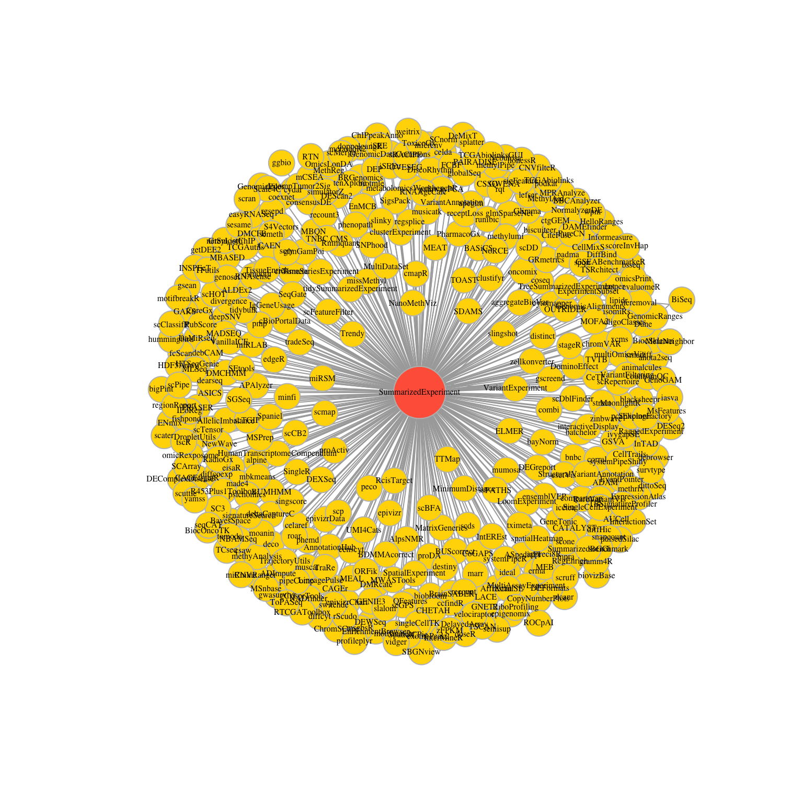

---
# Please do not edit this file directly; it is auto generated.
# Instead, please edit 60-next-steps.md in _episodes_rmd/
title: "Next steps"
source: Rmd
teaching: XX
exercises: XX
questions: SummarizedExperiment
objectives:
- Introduce the notion of data containers
- Give an overview of the `SummarizedExperiment`, extensively used in omics analyses
keypoints:
- '`SummarizedExperiment` represents an efficient way to store and to handle omics
  data'
- SummarizedExperiment is used in many Bioconductor packages
- We can use `tidySummarizedExperiment` to interact with SummarizedExperiment objects
  using tidyverse commands
---

## Next steps

Data in bioinformatics is often complex. For example, an experiment can have multiple types of files e.g. counts, sample information and gene information. To deal with this, developers define specialised
data containers (termed classes) that match the properties of the
data they need to handle. 

This aspect is central to the **Bioconductor**[^Bioconductor] project which
uses the same **core data infrastructure** across packages. This certainly contributed
to Bioconductor's success. Bioconductor package developers are advised to make
use of existing infrastructure to provide coherence, interoperability and stability to
the project as a whole. You will learn more about Bioconductor in the next episode.

[^Bioconductor]:The [Bioconductor](http://www.bioconductor.org) was initiated by Robert Gentleman, one of the two creators of the R language. Bioconductor provides tools dedicated to omics data analysis. Bioconductor uses the R statistical programming language, and is open source and open development.

## SummarizedExperiment

To illustrate a Bioconductor omics data container, we'll present the `SummarizedExperiment` class. This is a core structure for omics data such as genomics, transcriptomics, proteomics, methylation and cytometry. The image below from [this website](https://ivanek.github.io/analysisOfGenomicsDataWithR/02_IntroToBioc_html.html#4_Standard_Bioconductor_data_structures) shows how a large number of Bioconductor packages make use of SummarizedExperiment.

### What is it 

The figure below represents the anatomy of SummarizedExperiment.

* `assay()`, `assays()`: A matrix-like or list of matrix-like objects of identical dimension
  * rows: genes, genomic coordinates, etc.
  * columns: samples, cells, etc.
* `colData()`: Annotations on each column, as a DataFrame.
E.g., description of each sample
* `rowData()` and / or `rowRanges()`: Annotations on each row.
  * E.g., `rowRanges()`: coordinates of gene / exons in transcripts / etc.
  * E.g., `rowData()`:P-values and log-fold change of each gene after differential expresssion analysis.
* `metadata()`: List of unstructured metadata describing the overall content of the object.
  

### Benefits of SummarizedExperiment format

* Coordination of samples and features

As soon as the data for a project are distributed in multiple tables or files, the alignment of data records or the consistency of identifiers is precarious. The coordinated nature of the SummarizedExperiment container overcomes this by guaranteeing that
during data manipulation, the dimensions of the different slots will always match (i.e the columns
in the expression data and the rows in the sample metadata, as well
as the rows in the expression data and feature metadata) during data
manipulation. For example, if we had to exclude one sample from the assay,
it would be automatically removed from the sample metadata in the same operation. 

The metadata slots can grow additional co-variates
(columns) without affecting the other structures.

* Interoperability between packages

There are a lot of R packages that make use of SummarizedExperiment format. For the user this makes analysis easier as less data wrangling is required when outputs of one package can work as input for another. And with many packages using the SummarizedExperiment format there are less different formats to learn. If you follow a training focused on RNA sequencing analysis, you may learn to use the Bioconductor `DESeq2` package to do some differential expression analyses. `DESeq2`'s whole analysis is handled in a `SummarizedExperiment`. Or if you perform RNA sequencing analysis following tidy principles with the [tidybulk](https://stemangiola.github.io/tidybulk/) package you can input your data in SummarizedExperiment format. 

You can see packages making use of SummarizedExperiment (Depend/Import) on the [SummarizedExperiment homepage](https://bioconductor.org/packages/release/bioc/html/SummarizedExperiment.html), some shown in the screenshot below.

### When would you use it

You may encounter a SummarizedExperiment object 

* using a Bioconductor package function that imports your omics experiment files and produces a SummarizedExperiment object. The [tximeta](https://bioconductor.org/packages/release/bioc/vignettes/tximeta/inst/doc/tximeta.html#Tximeta_import_starts_with_sample_table) for transcript-level quantification is one example of this.  
* using processed data provided in SummarizedExperiment format. The [Recount3 project](http://rna.recount.bio/) provides RNA-sequencing gene, exon, and exon-exon junction counts for 8,679 and 10,088 different studies for human and mouse respectively in SummarizedExperiment format.  
* through creating one yourself to store your data or share with a collaborator

### Exploring a SummarizedExperiment

Let's explore a SummarizedExperiment object in R. We'll load in an example. This is the same RNA data we've been working with but also contains genomic coordinates/ranges. Ranges are an optional part of a SummarizedExperiment. When they're attached, the object is called a `RangedSummarizedExperiment`.

~~~
se <- readRDS("course-data/data/GSE96870/se2.rds")
~~~
{: .language-r}

~~~
se
~~~
{: .language-r}

~~~
Loading required package: SummarizedExperiment
~~~
{: .output}

~~~
Loading required package: MatrixGenerics
~~~
{: .output}

~~~
Loading required package: matrixStats
~~~
{: .output}

~~~

Attaching package: 'MatrixGenerics'
~~~
{: .output}

~~~
The following objects are masked from 'package:matrixStats':

    colAlls, colAnyNAs, colAnys, colAvgsPerRowSet, colCollapse,
    colCounts, colCummaxs, colCummins, colCumprods, colCumsums,
    colDiffs, colIQRDiffs, colIQRs, colLogSumExps, colMadDiffs,
    colMads, colMaxs, colMeans2, colMedians, colMins, colOrderStats,
    colProds, colQuantiles, colRanges, colRanks, colSdDiffs, colSds,
    colSums2, colTabulates, colVarDiffs, colVars, colWeightedMads,
    colWeightedMeans, colWeightedMedians, colWeightedSds,
    colWeightedVars, rowAlls, rowAnyNAs, rowAnys, rowAvgsPerColSet,
    rowCollapse, rowCounts, rowCummaxs, rowCummins, rowCumprods,
    rowCumsums, rowDiffs, rowIQRDiffs, rowIQRs, rowLogSumExps,
    rowMadDiffs, rowMads, rowMaxs, rowMeans2, rowMedians, rowMins,
    rowOrderStats, rowProds, rowQuantiles, rowRanges, rowRanks,
    rowSdDiffs, rowSds, rowSums2, rowTabulates, rowVarDiffs, rowVars,
    rowWeightedMads, rowWeightedMeans, rowWeightedMedians,
    rowWeightedSds, rowWeightedVars
~~~
{: .output}

~~~
Loading required package: GenomicRanges
~~~
{: .output}

~~~
Loading required package: stats4
~~~
{: .output}

~~~
Loading required package: BiocGenerics
~~~
{: .output}

~~~

Attaching package: 'BiocGenerics'
~~~
{: .output}

~~~
The following objects are masked from 'package:stats':

    IQR, mad, sd, var, xtabs
~~~
{: .output}

~~~
The following objects are masked from 'package:base':

    anyDuplicated, append, as.data.frame, basename, cbind, colnames,
    dirname, do.call, duplicated, eval, evalq, Filter, Find, get, grep,
    grepl, intersect, is.unsorted, lapply, Map, mapply, match, mget,
    order, paste, pmax, pmax.int, pmin, pmin.int, Position, rank,
    rbind, Reduce, rownames, sapply, setdiff, sort, table, tapply,
    union, unique, unsplit, which.max, which.min
~~~
{: .output}

~~~
Loading required package: S4Vectors
~~~
{: .output}

~~~

Attaching package: 'S4Vectors'
~~~
{: .output}

~~~
The following objects are masked from 'package:base':

    expand.grid, I, unname
~~~
{: .output}

~~~
Loading required package: IRanges
~~~
{: .output}

~~~
Loading required package: GenomeInfoDb
~~~
{: .output}

~~~
Loading required package: Biobase
~~~
{: .output}

~~~
Welcome to Bioconductor

    Vignettes contain introductory material; view with
    'browseVignettes()'. To cite Bioconductor, see
    'citation("Biobase")', and for packages 'citation("pkgname")'.
~~~
{: .output}

~~~

Attaching package: 'Biobase'
~~~
{: .output}

~~~
The following object is masked from 'package:MatrixGenerics':

    rowMedians
~~~
{: .output}

~~~
The following objects are masked from 'package:matrixStats':

    anyMissing, rowMedians
~~~
{: .output}

~~~
class: RangedSummarizedExperiment 
dim: 1474 22 
metadata(0):
assays(1): counts
rownames(1474): Asl Apod ... Lmx1a Pbx1
rowData names(11): gene ENTREZID ... phenotype_description
  hsapiens_homolog_associated_gene_name
colnames(22): GSM2545336 GSM2545337 ... GSM2545363 GSM2545380
colData names(10): title geo_accession ... tissue mouse
~~~
{: .output}

We can access the expression matrix with
the `assay` function:

~~~
head(assay(se))
~~~
{: .language-r}

~~~
        GSM2545336 GSM2545337 GSM2545338 GSM2545339 GSM2545340 GSM2545341
Asl           1170        361        400        586        626        988
Apod         36194      10347       9173      10620      13021      29594
Cyp2d22       4060       1616       1603       1901       2171       3349
Klk6           287        629        641        578        448        195
Fcrls           85        233        244        237        180         38
Slc2a4         782        231        248        265        313        786
        GSM2545342 GSM2545343 GSM2545344 GSM2545345 GSM2545346 GSM2545347
Asl            836        535        586        597        938       1035
Apod         24959      13668      13230      15868      27769      34301
Cyp2d22       3122       2008       2254       2277       2985       3452
Klk6           186       1101        537        567        327        233
Fcrls           68        375        199        177         89         67
Slc2a4         528        249        266        357        654        693
        GSM2545348 GSM2545349 GSM2545350 GSM2545351 GSM2545352 GSM2545353
Asl            494        481        666        937        803        541
Apod         11258      11812      15816      29242      20415      13682
Cyp2d22       1883       2014       2417       3678       2920       2216
Klk6           742        881        828        250        798        710
Fcrls          300        233        231         81        303        285
Slc2a4         271        304        349        715        513        320
        GSM2545354 GSM2545362 GSM2545363 GSM2545380
Asl            473        748        576       1192
Apod         11088      15916      11166      38148
Cyp2d22       1821       2842       2011       4019
Klk6           894        501        598        259
Fcrls          248        179        184         68
Slc2a4         248        350        317        796
~~~
{: .output}

~~~
dim(assay(se))
~~~
{: .language-r}

~~~
[1] 1474   22
~~~
{: .output}

We can access the sample metadata using the `colData` function:

~~~
colData(se)
~~~
{: .language-r}

~~~
DataFrame with 22 rows and 10 columns
                     title geo_accession     organism         age      sex
               <character>   <character>  <character> <character> <factor>
GSM2545336 CNS_RNA-seq_10C    GSM2545336 Mus musculus     8 weeks   Female
GSM2545337 CNS_RNA-seq_11C    GSM2545337 Mus musculus     8 weeks   Female
GSM2545338 CNS_RNA-seq_12C    GSM2545338 Mus musculus     8 weeks   Female
GSM2545339 CNS_RNA-seq_13C    GSM2545339 Mus musculus     8 weeks   Female
GSM2545340 CNS_RNA-seq_14C    GSM2545340 Mus musculus     8 weeks   Male  
...                    ...           ...          ...         ...      ...
GSM2545353  CNS_RNA-seq_3C    GSM2545353 Mus musculus     8 weeks   Female
GSM2545354  CNS_RNA-seq_4C    GSM2545354 Mus musculus     8 weeks   Male  
GSM2545362  CNS_RNA-seq_5C    GSM2545362 Mus musculus     8 weeks   Female
GSM2545363  CNS_RNA-seq_6C    GSM2545363 Mus musculus     8 weeks   Male  
GSM2545380  CNS_RNA-seq_9C    GSM2545380 Mus musculus     8 weeks   Female
             infection      strain     time     tissue    mouse
              <factor> <character> <factor>   <factor> <factor>
GSM2545336 InfluenzaA      C57BL/6     Day8 Cerebellum       14
GSM2545337 NonInfected     C57BL/6     Day0 Cerebellum       9 
GSM2545338 NonInfected     C57BL/6     Day0 Cerebellum       10
GSM2545339 InfluenzaA      C57BL/6     Day4 Cerebellum       15
GSM2545340 InfluenzaA      C57BL/6     Day4 Cerebellum       18
...                ...         ...      ...        ...      ...
GSM2545353 NonInfected     C57BL/6     Day0 Cerebellum       4 
GSM2545354 NonInfected     C57BL/6     Day0 Cerebellum       2 
GSM2545362 InfluenzaA      C57BL/6     Day4 Cerebellum       20
GSM2545363 InfluenzaA      C57BL/6     Day4 Cerebellum       12
GSM2545380 InfluenzaA      C57BL/6     Day8 Cerebellum       19
~~~
{: .output}

~~~
dim(colData(se))
~~~
{: .language-r}

~~~
[1] 22 10
~~~
{: .output}

We can also access the feature metadata using the `rowData` function:

~~~
head(rowData(se))
~~~
{: .language-r}

~~~
DataFrame with 6 rows and 11 columns
               gene    ENTREZID                product       gbkey
        <character> <character>            <character> <character>
Asl             Asl      109900 argininosuccinate ly..        mRNA
Apod           Apod       11815 apolipoprotein D, tr..        mRNA
Cyp2d22     Cyp2d22       56448 cytochrome P450, fam..        mRNA
Klk6           Klk6       19144 kallikrein related-p..        mRNA
Fcrls         Fcrls       80891 Fc receptor-like S, ..        mRNA
Slc2a4       Slc2a4       20528 solute carrier famil..        mRNA
        external_gene_name    ensembl_gene_id external_synonym chromosome_name
               <character>        <character>      <character>     <character>
Asl                    Asl ENSMUSG00000025533    2510006M18Rik               5
Apod                  Apod ENSMUSG00000022548               NA              16
Cyp2d22            Cyp2d22 ENSMUSG00000061740             2D22              15
Klk6                  Klk6 ENSMUSG00000050063             Bssp               7
Fcrls                Fcrls ENSMUSG00000015852    2810439C17Rik               3
Slc2a4              Slc2a4 ENSMUSG00000018566           Glut-4              11
          gene_biotype  phenotype_description
           <character>            <character>
Asl     protein_coding abnormal circulating..
Apod    protein_coding abnormal lipid homeo..
Cyp2d22 protein_coding abnormal skin morpho..
Klk6    protein_coding abnormal cytokine le..
Fcrls   protein_coding decreased CD8-positi..
Slc2a4  protein_coding abnormal circulating..
        hsapiens_homolog_associated_gene_name
                                  <character>
Asl                                       ASL
Apod                                     APOD
Cyp2d22                                CYP2D6
Klk6                                     KLK6
Fcrls                                   FCRL2
Slc2a4                                 SLC2A4
~~~
{: .output}

~~~
dim(rowData(se))
~~~
{: .language-r}

~~~
[1] 1474   11
~~~
{: .output}

If genomic coordinates are present, we can access using the `rowRanges` function:

~~~
rowRanges(se)
~~~
{: .language-r}

~~~
GRanges object with 1474 ranges and 11 metadata columns:
          seqnames              ranges strand |        gene    ENTREZID
             <Rle>           <IRanges>  <Rle> | <character> <character>
      Asl        5 130024208-130024330      - |         Asl      109900
     Apod       16   31314552-31314808      - |        Apod       11815
  Cyp2d22       15   82380078-82380260      - |     Cyp2d22       56448
     Klk6        7   43824544-43824595      + |        Klk6       19144
    Fcrls        3   87263678-87263765      - |       Fcrls       80891
      ...      ...                 ...    ... .         ...         ...
    Mgst3        1 167393751-167393797      - |       Mgst3       66447
   Lrrc52        1 167466093-167466780      - |      Lrrc52      240899
     Rxrg        1 167598362-167598800      + |        Rxrg       20183
    Lmx1a        1 167688300-167688991      + |       Lmx1a      110648
     Pbx1        1 168431314-168432169      - |        Pbx1       18514
                         product       gbkey external_gene_name
                     <character> <character>        <character>
      Asl argininosuccinate ly..        mRNA                Asl
     Apod apolipoprotein D, tr..        mRNA               Apod
  Cyp2d22 cytochrome P450, fam..        mRNA            Cyp2d22
     Klk6 kallikrein related-p..        mRNA               Klk6
    Fcrls Fc receptor-like S, ..        mRNA              Fcrls
      ...                    ...         ...                ...
    Mgst3 microsomal glutathio..        mRNA              Mgst3
   Lrrc52 leucine rich repeat ..        mRNA             Lrrc52
     Rxrg retinoid X receptor ..        mRNA               Rxrg
    Lmx1a LIM homeobox transcr..        mRNA              Lmx1a
     Pbx1 pre B cell leukemia ..        mRNA               Pbx1
             ensembl_gene_id external_synonym chromosome_name   gene_biotype
                 <character>      <character>     <character>    <character>
      Asl ENSMUSG00000025533    2510006M18Rik               5 protein_coding
     Apod ENSMUSG00000022548             <NA>              16 protein_coding
  Cyp2d22 ENSMUSG00000061740             2D22              15 protein_coding
     Klk6 ENSMUSG00000050063             Bssp               7 protein_coding
    Fcrls ENSMUSG00000015852    2810439C17Rik               3 protein_coding
      ...                ...              ...             ...            ...
    Mgst3 ENSMUSG00000026688    2010012L10Rik               1 protein_coding
   Lrrc52 ENSMUSG00000040485    4930413P14Rik               1 protein_coding
     Rxrg ENSMUSG00000015843            Nr2b3               1 protein_coding
    Lmx1a ENSMUSG00000026686           Lmx1.1               1 protein_coding
     Pbx1 ENSMUSG00000052534    2310056B04Rik               1 protein_coding
           phenotype_description hsapiens_homolog_associated_gene_name
                     <character>                           <character>
      Asl abnormal circulating..                                   ASL
     Apod abnormal lipid homeo..                                  APOD
  Cyp2d22 abnormal skin morpho..                                CYP2D6
     Klk6 abnormal cytokine le..                                  KLK6
    Fcrls decreased CD8-positi..                                 FCRL2
      ...                    ...                                   ...
    Mgst3 decreased mean corpu..                                 MGST3
   Lrrc52 abnormal sperm physi..                                LRRC52
     Rxrg abnormal bone minera..                                  RXRG
    Lmx1a abnormal bony labyri..                                 LMX1A
     Pbx1 abnormal adrenal gla..                                  PBX1
  -------
  seqinfo: 182 sequences from an unspecified genome; no seqlengths
~~~
{: .output}

`rowRanges` gives us the same information as `rowData` but also includes the coordinates.

### Creating a SummarizedExperiment

We will demonstrate how a SummarizedExperiment can be created. The different tables that make up a SummarizedExperiment object
- **An expression matrix**
- **A table describing the samples**
- **A table describing the genes**

~~~
count_matrix <- assay(se)
sample_metadata <- colData(se)
gene_metadata <- rowRanges(se) # or rowData(se)
~~~
{: .language-r}

We will create a `SummarizedExperiment` from these tables:

- The count matrix that will be used as the **`assay`**
- The table describing the samples will be used as the **sample metadata** slot
- The table describing the genes will be used as the **features metadata** slot

To do this we can put the different parts together using the
`SummarizedExperiment` constructor:

~~~
# BiocManager::install("SummarizedExperiment")
library("SummarizedExperiment")
~~~
{: .language-r}

To create the `SummarizedExperiment` object we need to provide inputs for the arguments `assays` (count matrix), `colData` (sample metadata) and `rowData` (gene metadata). Because `assays` can accept multiple assays (e.g. raw counts, log normalized) we put them in a list (SimpleList) and give each assay a name (we'll use counts). We can see we need to do this in the help for the SummarizedExperiment function `?SummarizedExperiment `.

~~~
se_created <- SummarizedExperiment(assays = SimpleList(counts=count_matrix),
                           colData = sample_metadata,
                           rowRanges = gene_metadata) # or rowData =
se_created
~~~
{: .language-r}

~~~
class: RangedSummarizedExperiment 
dim: 1474 22 
metadata(0):
assays(1): counts
rownames(1474): Asl Apod ... Lmx1a Pbx1
rowData names(11): gene ENTREZID ... phenotype_description
  hsapiens_homolog_associated_gene_name
colnames(22): GSM2545336 GSM2545337 ... GSM2545363 GSM2545380
colData names(10): title geo_accession ... tissue mouse
~~~
{: .output}

If we want to save a SummarizedExperiment object we can use the `saveRDS` function that we saw in a previous episode.

~~~
saveRDS(se_created, file = "data_output/se_created.rds")
~~~
{: .language-r}

### Subsetting a SummarizedExperiment

SummarizedExperiment can be subset just like with data frames,
with numerics, characters or logicals. There are two dimensions, the first dimension is features (genes) and the second dimension is samples.

To subset to the first 5 features we could do:

~~~
se[1:5, ]
~~~
{: .language-r}

~~~
class: RangedSummarizedExperiment 
dim: 5 22 
metadata(0):
assays(1): counts
rownames(5): Asl Apod Cyp2d22 Klk6 Fcrls
rowData names(11): gene ENTREZID ... phenotype_description
  hsapiens_homolog_associated_gene_name
colnames(22): GSM2545336 GSM2545337 ... GSM2545363 GSM2545380
colData names(10): title geo_accession ... tissue mouse
~~~
{: .output}

To subset to the first 3 samples we could do:

~~~
se[, 1:3]
~~~
{: .language-r}

~~~
class: RangedSummarizedExperiment 
dim: 1474 3 
metadata(0):
assays(1): counts
rownames(1474): Asl Apod ... Lmx1a Pbx1
rowData names(11): gene ENTREZID ... phenotype_description
  hsapiens_homolog_associated_gene_name
colnames(3): GSM2545336 GSM2545337 GSM2545338
colData names(10): title geo_accession ... tissue mouse
~~~
{: .output}

Below, we create a new instance of class SummarizedExperiment that contains only the first 5 features for the first 3 samples.

~~~
se1 <- se[1:5, 1:3]
se1
~~~
{: .language-r}

~~~
class: RangedSummarizedExperiment 
dim: 5 3 
metadata(0):
assays(1): counts
rownames(5): Asl Apod Cyp2d22 Klk6 Fcrls
rowData names(11): gene ENTREZID ... phenotype_description
  hsapiens_homolog_associated_gene_name
colnames(3): GSM2545336 GSM2545337 GSM2545338
colData names(10): title geo_accession ... tissue mouse
~~~
{: .output}

~~~
colData(se1)
~~~
{: .language-r}

~~~
DataFrame with 3 rows and 10 columns
                     title geo_accession     organism         age      sex
               <character>   <character>  <character> <character> <factor>
GSM2545336 CNS_RNA-seq_10C    GSM2545336 Mus musculus     8 weeks   Female
GSM2545337 CNS_RNA-seq_11C    GSM2545337 Mus musculus     8 weeks   Female
GSM2545338 CNS_RNA-seq_12C    GSM2545338 Mus musculus     8 weeks   Female
             infection      strain     time     tissue    mouse
              <factor> <character> <factor>   <factor> <factor>
GSM2545336 InfluenzaA      C57BL/6     Day8 Cerebellum       14
GSM2545337 NonInfected     C57BL/6     Day0 Cerebellum       9 
GSM2545338 NonInfected     C57BL/6     Day0 Cerebellum       10
~~~
{: .output}

~~~
rowData(se1)
~~~
{: .language-r}

~~~
DataFrame with 5 rows and 11 columns
               gene    ENTREZID                product       gbkey
        <character> <character>            <character> <character>
Asl             Asl      109900 argininosuccinate ly..        mRNA
Apod           Apod       11815 apolipoprotein D, tr..        mRNA
Cyp2d22     Cyp2d22       56448 cytochrome P450, fam..        mRNA
Klk6           Klk6       19144 kallikrein related-p..        mRNA
Fcrls         Fcrls       80891 Fc receptor-like S, ..        mRNA
        external_gene_name    ensembl_gene_id external_synonym chromosome_name
               <character>        <character>      <character>     <character>
Asl                    Asl ENSMUSG00000025533    2510006M18Rik               5
Apod                  Apod ENSMUSG00000022548               NA              16
Cyp2d22            Cyp2d22 ENSMUSG00000061740             2D22              15
Klk6                  Klk6 ENSMUSG00000050063             Bssp               7
Fcrls                Fcrls ENSMUSG00000015852    2810439C17Rik               3
          gene_biotype  phenotype_description
           <character>            <character>
Asl     protein_coding abnormal circulating..
Apod    protein_coding abnormal lipid homeo..
Cyp2d22 protein_coding abnormal skin morpho..
Klk6    protein_coding abnormal cytokine le..
Fcrls   protein_coding decreased CD8-positi..
        hsapiens_homolog_associated_gene_name
                                  <character>
Asl                                       ASL
Apod                                     APOD
Cyp2d22                                CYP2D6
Klk6                                     KLK6
Fcrls                                   FCRL2
~~~
{: .output}

We can also use the `colData()` function to subset on something from the sample metadata, or the `rowData()` to subset on something from the feature metadata.
For example, here we keep only miRNAs and the non infected samples:

~~~
se1 <- se[rowData(se)$gene_biotype == "miRNA",
          colData(se)$infection == "NonInfected"]
se1
~~~
{: .language-r}

~~~
class: RangedSummarizedExperiment 
dim: 7 7 
metadata(0):
assays(1): counts
rownames(7): Mir1901 Mir378a ... Mir128-1 Mir7682
rowData names(11): gene ENTREZID ... phenotype_description
  hsapiens_homolog_associated_gene_name
colnames(7): GSM2545337 GSM2545338 ... GSM2545353 GSM2545354
colData names(10): title geo_accession ... tissue mouse
~~~
{: .output}

~~~
assay(se1)
~~~
{: .language-r}

~~~
         GSM2545337 GSM2545338 GSM2545343 GSM2545348 GSM2545349 GSM2545353
Mir1901          45         44         74         55         68         33
Mir378a          11          7          9          4         12          4
Mir133b           4          6          5          4          6          7
Mir30c-2         10          6         16         12          8         17
Mir149            1          2          0          0          0          0
Mir128-1          4          1          2          2          1          2
Mir7682           2          0          4          1          3          5
         GSM2545354
Mir1901          60
Mir378a           8
Mir133b           3
Mir30c-2         15
Mir149            2
Mir128-1          1
Mir7682           5
~~~
{: .output}

~~~
colData(se1)
~~~
{: .language-r}

~~~
DataFrame with 7 rows and 10 columns
                     title geo_accession     organism         age      sex
               <character>   <character>  <character> <character> <factor>
GSM2545337 CNS_RNA-seq_11C    GSM2545337 Mus musculus     8 weeks   Female
GSM2545338 CNS_RNA-seq_12C    GSM2545338 Mus musculus     8 weeks   Female
GSM2545343 CNS_RNA-seq_20C    GSM2545343 Mus musculus     8 weeks   Male  
GSM2545348 CNS_RNA-seq_27C    GSM2545348 Mus musculus     8 weeks   Female
GSM2545349 CNS_RNA-seq_28C    GSM2545349 Mus musculus     8 weeks   Male  
GSM2545353  CNS_RNA-seq_3C    GSM2545353 Mus musculus     8 weeks   Female
GSM2545354  CNS_RNA-seq_4C    GSM2545354 Mus musculus     8 weeks   Male  
             infection      strain     time     tissue    mouse
              <factor> <character> <factor>   <factor> <factor>
GSM2545337 NonInfected     C57BL/6     Day0 Cerebellum       9 
GSM2545338 NonInfected     C57BL/6     Day0 Cerebellum       10
GSM2545343 NonInfected     C57BL/6     Day0 Cerebellum       11
GSM2545348 NonInfected     C57BL/6     Day0 Cerebellum       8 
GSM2545349 NonInfected     C57BL/6     Day0 Cerebellum       7 
GSM2545353 NonInfected     C57BL/6     Day0 Cerebellum       4 
GSM2545354 NonInfected     C57BL/6     Day0 Cerebellum       2 
~~~
{: .output}

~~~
rowData(se1)
~~~
{: .language-r}

~~~
DataFrame with 7 rows and 11 columns
                gene    ENTREZID        product         gbkey
         <character> <character>    <character>   <character>
Mir1901      Mir1901   100316686  microRNA 1901 precursor_RNA
Mir378a      Mir378a      723889  microRNA 378a precursor_RNA
Mir133b      Mir133b      723817  microRNA 133b precursor_RNA
Mir30c-2    Mir30c-2      723964 microRNA 30c-2 precursor_RNA
Mir149        Mir149      387167   microRNA 149 precursor_RNA
Mir128-1    Mir128-1      387147 microRNA 128-1 precursor_RNA
Mir7682      Mir7682   102466847  microRNA 7682 precursor_RNA
         external_gene_name    ensembl_gene_id external_synonym chromosome_name
                <character>        <character>      <character>     <character>
Mir1901             Mir1901 ENSMUSG00000084565         Mirn1901              18
Mir378a             Mir378a ENSMUSG00000105200          Mirn378              18
Mir133b             Mir133b ENSMUSG00000065480         mir 133b               1
Mir30c-2           Mir30c-2 ENSMUSG00000065567        mir 30c-2               1
Mir149               Mir149 ENSMUSG00000065470          Mirn149               1
Mir128-1           Mir128-1 ENSMUSG00000065520          Mirn128               1
Mir7682             Mir7682 ENSMUSG00000106406     mmu-mir-7682               1
         gene_biotype  phenotype_description
          <character>            <character>
Mir1901         miRNA                     NA
Mir378a         miRNA abnormal mitochondri..
Mir133b         miRNA no abnormal phenotyp..
Mir30c-2        miRNA                     NA
Mir149          miRNA increased circulatin..
Mir128-1        miRNA no abnormal phenotyp..
Mir7682         miRNA                     NA
         hsapiens_homolog_associated_gene_name
                                   <character>
Mir1901                                     NA
Mir378a                                MIR378A
Mir133b                                MIR133B
Mir30c-2                               MIR30C2
Mir149                                      NA
Mir128-1                              MIR128-1
Mir7682                                     NA
~~~
{: .output}

We can subset to a genomic region of interest using the `subsetByOverlaps` function.

~~~
# Define a region of interest e.g. interval 1 to 10,000,000 of chromosome 1 
roi <- GRanges(seqnames="1", ranges=1:10000000)
# Subset se object for only rows in the region of interest
subsetByOverlaps(se, roi)
~~~
{: .language-r}

~~~
class: RangedSummarizedExperiment 
dim: 20 22 
metadata(0):
assays(1): counts
rownames(20): Sox17 Rp1 ... Snord87 Tcf24
rowData names(11): gene ENTREZID ... phenotype_description
  hsapiens_homolog_associated_gene_name
colnames(22): GSM2545336 GSM2545337 ... GSM2545363 GSM2545380
colData names(10): title geo_accession ... tissue mouse
~~~
{: .output}

> ## Challenge
>
> 1. Extract the gene expression levels of the first 3 genes in samples at time 0 and at time 8.
> 2. Extract all genes on chromosome Y between 1 and 10,000,000 on the negative strand.
>
> > ## Solution
> >
> >
> > 
> > ~~~
> > assay(se)[1:3, colData(se)$time != "Day4"]
> > ~~~
> > {: .language-r}
> > 
> > 
> > 
> > ~~~
> >         GSM2545336 GSM2545337 GSM2545338 GSM2545341 GSM2545342 GSM2545343
> > Asl           1170        361        400        988        836        535
> > Apod         36194      10347       9173      29594      24959      13668
> > Cyp2d22       4060       1616       1603       3349       3122       2008
> >         GSM2545346 GSM2545347 GSM2545348 GSM2545349 GSM2545351 GSM2545353
> > Asl            938       1035        494        481        937        541
> > Apod         27769      34301      11258      11812      29242      13682
> > Cyp2d22       2985       3452       1883       2014       3678       2216
> >         GSM2545354 GSM2545380
> > Asl            473       1192
> > Apod         11088      38148
> > Cyp2d22       1821       4019
> > ~~~
> > {: .output}
> > 
> > 
> > 
> > ~~~
> > # Equivalent to
> > assay(se)[1:3, colData(se)$time == "Day0" | colData(se)$time == "Day8"]
> > ~~~
> > {: .language-r}
> > 
> > 
> > 
> > ~~~
> >         GSM2545336 GSM2545337 GSM2545338 GSM2545341 GSM2545342 GSM2545343
> > Asl           1170        361        400        988        836        535
> > Apod         36194      10347       9173      29594      24959      13668
> > Cyp2d22       4060       1616       1603       3349       3122       2008
> >         GSM2545346 GSM2545347 GSM2545348 GSM2545349 GSM2545351 GSM2545353
> > Asl            938       1035        494        481        937        541
> > Apod         27769      34301      11258      11812      29242      13682
> > Cyp2d22       2985       3452       1883       2014       3678       2216
> >         GSM2545354 GSM2545380
> > Asl            473       1192
> > Apod         11088      38148
> > Cyp2d22       1821       4019
> > ~~~
> > {: .output}
> >
> > 
> > ~~~
> > roi <- GRanges(seqnames="Y", ranges = 1:10000000, strand = "-")
> > subsetByOverlaps(se, roi)
> > ~~~
> > {: .language-r}
> > 
> > 
> > 
> > ~~~
> > class: RangedSummarizedExperiment 
> > dim: 3 22 
> > metadata(0):
> > assays(1): counts
> > rownames(3): Ddx3y Uty Gm4017
> > rowData names(11): gene ENTREZID ... phenotype_description
> >   hsapiens_homolog_associated_gene_name
> > colnames(22): GSM2545336 GSM2545337 ... GSM2545363 GSM2545380
> > colData names(10): title geo_accession ... tissue mouse
> > ~~~
> > {: .output}
> {: .solution}
{: .challenge}

#### Adding variables to metadata

We can also add information to the sample metadata.
Suppose that you want to add the center where the samples were collected...

~~~
colData(se)$center <- rep("University of Illinois", nrow(colData(se)))
colData(se)
~~~
{: .language-r}

~~~
DataFrame with 22 rows and 11 columns
                     title geo_accession     organism         age      sex
               <character>   <character>  <character> <character> <factor>
GSM2545336 CNS_RNA-seq_10C    GSM2545336 Mus musculus     8 weeks   Female
GSM2545337 CNS_RNA-seq_11C    GSM2545337 Mus musculus     8 weeks   Female
GSM2545338 CNS_RNA-seq_12C    GSM2545338 Mus musculus     8 weeks   Female
GSM2545339 CNS_RNA-seq_13C    GSM2545339 Mus musculus     8 weeks   Female
GSM2545340 CNS_RNA-seq_14C    GSM2545340 Mus musculus     8 weeks   Male  
...                    ...           ...          ...         ...      ...
GSM2545353  CNS_RNA-seq_3C    GSM2545353 Mus musculus     8 weeks   Female
GSM2545354  CNS_RNA-seq_4C    GSM2545354 Mus musculus     8 weeks   Male  
GSM2545362  CNS_RNA-seq_5C    GSM2545362 Mus musculus     8 weeks   Female
GSM2545363  CNS_RNA-seq_6C    GSM2545363 Mus musculus     8 weeks   Male  
GSM2545380  CNS_RNA-seq_9C    GSM2545380 Mus musculus     8 weeks   Female
             infection      strain     time     tissue    mouse
              <factor> <character> <factor>   <factor> <factor>
GSM2545336 InfluenzaA      C57BL/6     Day8 Cerebellum       14
GSM2545337 NonInfected     C57BL/6     Day0 Cerebellum       9 
GSM2545338 NonInfected     C57BL/6     Day0 Cerebellum       10
GSM2545339 InfluenzaA      C57BL/6     Day4 Cerebellum       15
GSM2545340 InfluenzaA      C57BL/6     Day4 Cerebellum       18
...                ...         ...      ...        ...      ...
GSM2545353 NonInfected     C57BL/6     Day0 Cerebellum       4 
GSM2545354 NonInfected     C57BL/6     Day0 Cerebellum       2 
GSM2545362 InfluenzaA      C57BL/6     Day4 Cerebellum       20
GSM2545363 InfluenzaA      C57BL/6     Day4 Cerebellum       12
GSM2545380 InfluenzaA      C57BL/6     Day8 Cerebellum       19
                           center
                      <character>
GSM2545336 University of Illinois
GSM2545337 University of Illinois
GSM2545338 University of Illinois
GSM2545339 University of Illinois
GSM2545340 University of Illinois
...                           ...
GSM2545353 University of Illinois
GSM2545354 University of Illinois
GSM2545362 University of Illinois
GSM2545363 University of Illinois
GSM2545380 University of Illinois
~~~
{: .output}

This illustrates that the metadata slots can grow indefinitely without affecting
the other structures!

## tidySummarizedExperiment

You may be wondering, can we use tidyverse commands to interact with SummarizedExperiment objects. The answer is yes, we can with the tidySummarizedExperiment package.

Remember what our SummarizedExperiment object looks like.

~~~
se
~~~
{: .language-r}

~~~
class: RangedSummarizedExperiment 
dim: 1474 22 
metadata(0):
assays(1): counts
rownames(1474): Asl Apod ... Lmx1a Pbx1
rowData names(11): gene ENTREZID ... phenotype_description
  hsapiens_homolog_associated_gene_name
colnames(22): GSM2545336 GSM2545337 ... GSM2545363 GSM2545380
colData names(11): title geo_accession ... mouse center
~~~
{: .output}

Load tidyverse and tidySummarizedExperiment and then take a look at the se object again.

~~~
# BiocManager::install("tidySummarizedExperiment")
library("tidyverse")
library("tidySummarizedExperiment")

se
~~~
{: .language-r}

~~~
# A SummarizedExperiment-tibble abstraction: 32,428 × 22
# Features=1474 | Samples=22 | Assays=counts
   .feature .sample    counts title geo_accession organism age   sex   infection
   <chr>    <chr>       <int> <chr> <chr>         <chr>    <chr> <fct> <fct>    
 1 Asl      GSM2545336   1170 CNS_… GSM2545336    Mus mus… 8 we… Fema… Influenz…
 2 Apod     GSM2545336  36194 CNS_… GSM2545336    Mus mus… 8 we… Fema… Influenz…
 3 Cyp2d22  GSM2545336   4060 CNS_… GSM2545336    Mus mus… 8 we… Fema… Influenz…
 4 Klk6     GSM2545336    287 CNS_… GSM2545336    Mus mus… 8 we… Fema… Influenz…
 5 Fcrls    GSM2545336     85 CNS_… GSM2545336    Mus mus… 8 we… Fema… Influenz…
 6 Slc2a4   GSM2545336    782 CNS_… GSM2545336    Mus mus… 8 we… Fema… Influenz…
 7 Exd2     GSM2545336   1619 CNS_… GSM2545336    Mus mus… 8 we… Fema… Influenz…
 8 Gjc2     GSM2545336    288 CNS_… GSM2545336    Mus mus… 8 we… Fema… Influenz…
 9 Plp1     GSM2545336  43217 CNS_… GSM2545336    Mus mus… 8 we… Fema… Influenz…
10 Gnb4     GSM2545336   1071 CNS_… GSM2545336    Mus mus… 8 we… Fema… Influenz…
# … with 40 more rows, and 21 more variables: strain <chr>, time <fct>,
#   tissue <fct>, mouse <fct>, center <chr>, gene <chr>, ENTREZID <chr>,
#   product <chr>, gbkey <chr>, external_gene_name <chr>,
#   ensembl_gene_id <chr>, external_synonym <chr>, chromosome_name <chr>,
#   gene_biotype <chr>, phenotype_description <chr>,
#   hsapiens_homolog_associated_gene_name <chr>, seqnames <fct>, start <int>,
#   end <int>, width <int>, strand <fct>
~~~
{: .output}

It's still a SummarizedExperiment object but now we can view it as a tibble. Note the first line of the output says this, it's a SummarizedExperiment-tibble abstraction. We can also see in the second line of the output the number of transcripts and samples. 

> ## Reverting to standard SummarizedExperiment view
>
> If we want to revert to the standard SummarizedExperiment view we can do that.
>
> 
> ~~~
> options("restore_SummarizedExperiment_show" = TRUE)
> se
> ~~~
> {: .language-r}
> 
> 
> 
> ~~~
> class: RangedSummarizedExperiment 
> dim: 1474 22 
> metadata(0):
> assays(1): counts
> rownames(1474): Asl Apod ... Lmx1a Pbx1
> rowData names(11): gene ENTREZID ... phenotype_description
>   hsapiens_homolog_associated_gene_name
> colnames(22): GSM2545336 GSM2545337 ... GSM2545363 GSM2545380
> colData names(11): title geo_accession ... mouse center
> ~~~
> {: .output}
> 
> If we want to revert back to tidy SummarizedExperiment view we can.
> 
> 
> ~~~
> options("restore_SummarizedExperiment_show" = FALSE)
> se
> ~~~
> {: .language-r}
> 
> 
> 
> ~~~
> # A SummarizedExperiment-tibble abstraction: 32,428 × 22
> # Features=1474 | Samples=22 | Assays=counts
>    .feature .sample    counts title geo_accession organism age   sex   infection
>    <chr>    <chr>       <int> <chr> <chr>         <chr>    <chr> <fct> <fct>    
>  1 Asl      GSM2545336   1170 CNS_… GSM2545336    Mus mus… 8 we… Fema… Influenz…
>  2 Apod     GSM2545336  36194 CNS_… GSM2545336    Mus mus… 8 we… Fema… Influenz…
>  3 Cyp2d22  GSM2545336   4060 CNS_… GSM2545336    Mus mus… 8 we… Fema… Influenz…
>  4 Klk6     GSM2545336    287 CNS_… GSM2545336    Mus mus… 8 we… Fema… Influenz…
>  5 Fcrls    GSM2545336     85 CNS_… GSM2545336    Mus mus… 8 we… Fema… Influenz…
>  6 Slc2a4   GSM2545336    782 CNS_… GSM2545336    Mus mus… 8 we… Fema… Influenz…
>  7 Exd2     GSM2545336   1619 CNS_… GSM2545336    Mus mus… 8 we… Fema… Influenz…
>  8 Gjc2     GSM2545336    288 CNS_… GSM2545336    Mus mus… 8 we… Fema… Influenz…
>  9 Plp1     GSM2545336  43217 CNS_… GSM2545336    Mus mus… 8 we… Fema… Influenz…
> 10 Gnb4     GSM2545336   1071 CNS_… GSM2545336    Mus mus… 8 we… Fema… Influenz…
> # … with 40 more rows, and 21 more variables: strain <chr>, time <fct>,
> #   tissue <fct>, mouse <fct>, center <chr>, gene <chr>, ENTREZID <chr>,
> #   product <chr>, gbkey <chr>, external_gene_name <chr>,
> #   ensembl_gene_id <chr>, external_synonym <chr>, chromosome_name <chr>,
> #   gene_biotype <chr>, phenotype_description <chr>,
> #   hsapiens_homolog_associated_gene_name <chr>, seqnames <fct>, start <int>,
> #   end <int>, width <int>, strand <fct>
> ~~~
> {: .output}
>
{: .callout}

We can now use tidyverse commands to interact with the SummarizedExperiment object.

We can use `filter` to filter for rows using a condition e.g. to remove a failed sample.

~~~
se %>% 
    filter(.sample != "GSM2545336")
~~~
{: .language-r}

~~~
# A SummarizedExperiment-tibble abstraction: 30,954 × 21
# Features=1474 | Samples=21 | Assays=counts
   .feature .sample    counts title geo_accession organism age   sex   infection
   <chr>    <chr>       <int> <chr> <chr>         <chr>    <chr> <fct> <fct>    
 1 Asl      GSM2545337    361 CNS_… GSM2545337    Mus mus… 8 we… Fema… NonInfec…
 2 Apod     GSM2545337  10347 CNS_… GSM2545337    Mus mus… 8 we… Fema… NonInfec…
 3 Cyp2d22  GSM2545337   1616 CNS_… GSM2545337    Mus mus… 8 we… Fema… NonInfec…
 4 Klk6     GSM2545337    629 CNS_… GSM2545337    Mus mus… 8 we… Fema… NonInfec…
 5 Fcrls    GSM2545337    233 CNS_… GSM2545337    Mus mus… 8 we… Fema… NonInfec…
 6 Slc2a4   GSM2545337    231 CNS_… GSM2545337    Mus mus… 8 we… Fema… NonInfec…
 7 Exd2     GSM2545337   2288 CNS_… GSM2545337    Mus mus… 8 we… Fema… NonInfec…
 8 Gjc2     GSM2545337    595 CNS_… GSM2545337    Mus mus… 8 we… Fema… NonInfec…
 9 Plp1     GSM2545337 101241 CNS_… GSM2545337    Mus mus… 8 we… Fema… NonInfec…
10 Gnb4     GSM2545337   1791 CNS_… GSM2545337    Mus mus… 8 we… Fema… NonInfec…
# … with 40 more rows, and 21 more variables: strain <chr>, time <fct>,
#   tissue <fct>, mouse <fct>, center <chr>, gene <chr>, ENTREZID <chr>,
#   product <chr>, gbkey <chr>, external_gene_name <chr>,
#   ensembl_gene_id <chr>, external_synonym <chr>, chromosome_name <chr>,
#   gene_biotype <chr>, phenotype_description <chr>,
#   hsapiens_homolog_associated_gene_name <chr>, seqnames <fct>, start <int>,
#   end <int>, width <int>, strand <fct>
~~~
{: .output}

We can use `select` to specify columns we want to view. 

~~~
se %>% 
    select(.sample)
~~~
{: .language-r}

~~~
tidySummarizedExperiment says: Key columns are missing. A data frame is returned for independent data analysis.
~~~
{: .output}

~~~
# A tibble: 32,428 × 1
   .sample   
   <chr>     
 1 GSM2545336
 2 GSM2545336
 3 GSM2545336
 4 GSM2545336
 5 GSM2545336
 6 GSM2545336
 7 GSM2545336
 8 GSM2545336
 9 GSM2545336
10 GSM2545336
# … with 32,418 more rows
~~~
{: .output}

~~~
se %>%
    count(.sample)
~~~
{: .language-r}

~~~
tidySummarizedExperiment says: A data frame is returned for independent data analysis.
~~~
{: .output}

~~~
# A tibble: 22 × 2
   .sample        n
   <chr>      <int>
 1 GSM2545336  1474
 2 GSM2545337  1474
 3 GSM2545338  1474
 4 GSM2545339  1474
 5 GSM2545340  1474
 6 GSM2545341  1474
 7 GSM2545342  1474
 8 GSM2545343  1474
 9 GSM2545344  1474
10 GSM2545345  1474
# … with 12 more rows
~~~
{: .output}

We can use `mutate` to add metadata info.

~~~
se %>%
    mutate(center = "University of Melbourne")
~~~
{: .language-r}

~~~
# A SummarizedExperiment-tibble abstraction: 32,428 × 22
# Features=1474 | Samples=22 | Assays=counts
   .feature .sample    counts title geo_accession organism age   sex   infection
   <chr>    <chr>       <int> <chr> <chr>         <chr>    <chr> <fct> <fct>    
 1 Asl      GSM2545336   1170 CNS_… GSM2545336    Mus mus… 8 we… Fema… Influenz…
 2 Apod     GSM2545336  36194 CNS_… GSM2545336    Mus mus… 8 we… Fema… Influenz…
 3 Cyp2d22  GSM2545336   4060 CNS_… GSM2545336    Mus mus… 8 we… Fema… Influenz…
 4 Klk6     GSM2545336    287 CNS_… GSM2545336    Mus mus… 8 we… Fema… Influenz…
 5 Fcrls    GSM2545336     85 CNS_… GSM2545336    Mus mus… 8 we… Fema… Influenz…
 6 Slc2a4   GSM2545336    782 CNS_… GSM2545336    Mus mus… 8 we… Fema… Influenz…
 7 Exd2     GSM2545336   1619 CNS_… GSM2545336    Mus mus… 8 we… Fema… Influenz…
 8 Gjc2     GSM2545336    288 CNS_… GSM2545336    Mus mus… 8 we… Fema… Influenz…
 9 Plp1     GSM2545336  43217 CNS_… GSM2545336    Mus mus… 8 we… Fema… Influenz…
10 Gnb4     GSM2545336   1071 CNS_… GSM2545336    Mus mus… 8 we… Fema… Influenz…
# … with 40 more rows, and 21 more variables: strain <chr>, time <fct>,
#   tissue <fct>, mouse <fct>, center <chr>, gene <chr>, ENTREZID <chr>,
#   product <chr>, gbkey <chr>, external_gene_name <chr>,
#   ensembl_gene_id <chr>, external_synonym <chr>, chromosome_name <chr>,
#   gene_biotype <chr>, phenotype_description <chr>,
#   hsapiens_homolog_associated_gene_name <chr>, seqnames <fct>, start <int>,
#   end <int>, width <int>, strand <fct>
~~~
{: .output}

We can also combine commands with the tidyverse pipe `%>%`.

For example, we could combine `group_by` and `summarise` to get the total counts for each sample.

~~~
se %>%
    group_by(.sample) %>%
    summarise(total_counts=sum(counts))
~~~
{: .language-r}

~~~
tidySummarizedExperiment says: A data frame is returned for independent data analysis.
~~~
{: .output}

~~~
# A tibble: 22 × 2
   .sample    total_counts
   <chr>             <int>
 1 GSM2545336      3039671
 2 GSM2545337      2602360
 3 GSM2545338      2458618
 4 GSM2545339      2500082
 5 GSM2545340      2479024
 6 GSM2545341      2413723
 7 GSM2545342      2349728
 8 GSM2545343      3105652
 9 GSM2545344      2524137
10 GSM2545345      2506038
# … with 12 more rows
~~~
{: .output}

Some other tidyverse commands we haven't seen before but that are useful are `slice`, `distinct` and `unite`.

We can use `slice` to choose rows by number e.g. to choose the first row.

~~~
se %>% 
    slice(1)
~~~
{: .language-r}

~~~
# A SummarizedExperiment-tibble abstraction: 1 × 1
# Features=1 | Samples=1 | Assays=counts
  .feature .sample    counts title  geo_accession organism age   sex   infection
  <chr>    <chr>       <int> <chr>  <chr>         <chr>    <chr> <fct> <fct>    
1 Asl      GSM2545336   1170 CNS_R… GSM2545336    Mus mus… 8 we… Fema… Influenz…
# … with 21 more variables: strain <chr>, time <fct>, tissue <fct>,
#   mouse <fct>, center <chr>, gene <chr>, ENTREZID <chr>, product <chr>,
#   gbkey <chr>, external_gene_name <chr>, ensembl_gene_id <chr>,
#   external_synonym <chr>, chromosome_name <chr>, gene_biotype <chr>,
#   phenotype_description <chr>, hsapiens_homolog_associated_gene_name <chr>,
#   seqnames <fct>, start <int>, end <int>, width <int>, strand <fct>
~~~
{: .output}

We can use `distinct` to see what unique information we have.

~~~
se %>%
    distinct(.sample, infection, sex)
~~~
{: .language-r}

~~~
tidySummarizedExperiment says: A data frame is returned for independent data analysis.
~~~
{: .output}

~~~
# A tibble: 22 × 3
   .sample    sex    infection  
   <chr>      <fct>  <fct>      
 1 GSM2545336 Female InfluenzaA 
 2 GSM2545337 Female NonInfected
 3 GSM2545338 Female NonInfected
 4 GSM2545339 Female InfluenzaA 
 5 GSM2545340 Male   InfluenzaA 
 6 GSM2545341 Male   InfluenzaA 
 7 GSM2545342 Female InfluenzaA 
 8 GSM2545343 Male   NonInfected
 9 GSM2545344 Female InfluenzaA 
10 GSM2545345 Male   InfluenzaA 
# … with 12 more rows
~~~
{: .output}

We can use `unite` to combine multiple columns into a single column.

~~~
se %>%
    unite("group", c(infection, time))
~~~
{: .language-r}

~~~
tidySummarizedExperiment says: Key columns are missing. A data frame is returned for independent data analysis.
~~~
{: .output}

~~~
# A SummarizedExperiment-tibble abstraction: 32,428 × 22
# Features=1474 | Samples=22 | Assays=counts
   .feature .sample counts title geo_accession organism age   sex   group strain
   <chr>    <chr>    <int> <chr> <chr>         <chr>    <chr> <fct> <chr> <chr> 
 1 Asl      GSM254…   1170 CNS_… GSM2545336    Mus mus… 8 we… Fema… Infl… C57BL…
 2 Apod     GSM254…  36194 CNS_… GSM2545336    Mus mus… 8 we… Fema… Infl… C57BL…
 3 Cyp2d22  GSM254…   4060 CNS_… GSM2545336    Mus mus… 8 we… Fema… Infl… C57BL…
 4 Klk6     GSM254…    287 CNS_… GSM2545336    Mus mus… 8 we… Fema… Infl… C57BL…
 5 Fcrls    GSM254…     85 CNS_… GSM2545336    Mus mus… 8 we… Fema… Infl… C57BL…
 6 Slc2a4   GSM254…    782 CNS_… GSM2545336    Mus mus… 8 we… Fema… Infl… C57BL…
 7 Exd2     GSM254…   1619 CNS_… GSM2545336    Mus mus… 8 we… Fema… Infl… C57BL…
 8 Gjc2     GSM254…    288 CNS_… GSM2545336    Mus mus… 8 we… Fema… Infl… C57BL…
 9 Plp1     GSM254…  43217 CNS_… GSM2545336    Mus mus… 8 we… Fema… Infl… C57BL…
10 Gnb4     GSM254…   1071 CNS_… GSM2545336    Mus mus… 8 we… Fema… Infl… C57BL…
# … with 40 more rows, and 19 more variables: tissue <fct>, mouse <fct>,
#   center <chr>, gene <chr>, ENTREZID <chr>, product <chr>, gbkey <chr>,
#   external_gene_name <chr>, ensembl_gene_id <chr>, external_synonym <chr>,
#   chromosome_name <chr>, gene_biotype <chr>, phenotype_description <chr>,
#   hsapiens_homolog_associated_gene_name <chr>, seqnames <fct>, start <int>,
#   end <int>, width <int>, strand <fct>
~~~
{: .output}

We can treat `se` as a normal tibble for plotting.

Here we plot the distribution of counts per sample.

~~~
se %>%
    ggplot(aes(counts + 1, group=.sample, color=infection)) +
    geom_density() +
    scale_x_log10() +
    theme_bw()
~~~
{: .language-r}

To work with genomic coordinates (ranges) with tidy methods, performing subsetting etc,  we can use the [plyranges](https://bioconductor.org/packages/devel/bioc/vignettes/plyranges/inst/doc/an-introduction.html#1_Ranges_revisited) package.

> ## Challenge
>
> 1. Extract the miRNA and NonInfected this time using tidyverse commands.
> 2. Extract the gene expression levels of the 3 first genes in samples at time 0 and at time 8 this time using tidyverse commands.
> 3. Create a bar plot of the sample counts using the se object. Hint use geom_col to plot the summarised counts.
> 
> > ## Solution
> >
> > 
> > ~~~
> > se %>% 
> > filter(gene_biotype == "miRNA" & infection == "NonInfected")
> > ~~~
> > {: .language-r}
> > 
> > 
> > 
> > ~~~
> > # A SummarizedExperiment-tibble abstraction: 49 × 7
> > # Features=7 | Samples=7 | Assays=counts
> >    .feature .sample    counts title geo_accession organism age   sex   infection
> >    <chr>    <chr>       <int> <chr> <chr>         <chr>    <chr> <fct> <fct>    
> >  1 Mir1901  GSM2545337     45 CNS_… GSM2545337    Mus mus… 8 we… Fema… NonInfec…
> >  2 Mir378a  GSM2545337     11 CNS_… GSM2545337    Mus mus… 8 we… Fema… NonInfec…
> >  3 Mir133b  GSM2545337      4 CNS_… GSM2545337    Mus mus… 8 we… Fema… NonInfec…
> >  4 Mir30c-2 GSM2545337     10 CNS_… GSM2545337    Mus mus… 8 we… Fema… NonInfec…
> >  5 Mir149   GSM2545337      1 CNS_… GSM2545337    Mus mus… 8 we… Fema… NonInfec…
> >  6 Mir128-1 GSM2545337      4 CNS_… GSM2545337    Mus mus… 8 we… Fema… NonInfec…
> >  7 Mir7682  GSM2545337      2 CNS_… GSM2545337    Mus mus… 8 we… Fema… NonInfec…
> >  8 Mir1901  GSM2545338     44 CNS_… GSM2545338    Mus mus… 8 we… Fema… NonInfec…
> >  9 Mir378a  GSM2545338      7 CNS_… GSM2545338    Mus mus… 8 we… Fema… NonInfec…
> > 10 Mir133b  GSM2545338      6 CNS_… GSM2545338    Mus mus… 8 we… Fema… NonInfec…
> > # … with 39 more rows, and 21 more variables: strain <chr>, time <fct>,
> > #   tissue <fct>, mouse <fct>, center <chr>, gene <chr>, ENTREZID <chr>,
> > #   product <chr>, gbkey <chr>, external_gene_name <chr>,
> > #   ensembl_gene_id <chr>, external_synonym <chr>, chromosome_name <chr>,
> > #   gene_biotype <chr>, phenotype_description <chr>,
> > #   hsapiens_homolog_associated_gene_name <chr>, seqnames <fct>, start <int>,
> > #   end <int>, width <int>, strand <fct>
> > ~~~
> > {: .output}
> >
> > 
> > ~~~
> > se %>% 
> >   filter(time == "Day0" | time == "Day8") %>% 
> >   group_by(.sample) %>% 
> >   slice(1:3)
> > ~~~
> > {: .language-r}
> > 
> > 
> > 
> > ~~~
> > tidySummarizedExperiment says: A data frame is returned for independent data analysis.
> > ~~~
> > {: .output}
> > 
> > 
> > 
> > ~~~
> > # A tibble: 42 × 30
> > # Groups:   .sample [14]
> >    .feature .sample    counts title geo_accession organism age   sex   infection
> >    <chr>    <chr>       <int> <chr> <chr>         <chr>    <chr> <fct> <fct>    
> >  1 Asl      GSM2545336   1170 CNS_… GSM2545336    Mus mus… 8 we… Fema… Influenz…
> >  2 Apod     GSM2545336  36194 CNS_… GSM2545336    Mus mus… 8 we… Fema… Influenz…
> >  3 Cyp2d22  GSM2545336   4060 CNS_… GSM2545336    Mus mus… 8 we… Fema… Influenz…
> >  4 Asl      GSM2545337    361 CNS_… GSM2545337    Mus mus… 8 we… Fema… NonInfec…
> >  5 Apod     GSM2545337  10347 CNS_… GSM2545337    Mus mus… 8 we… Fema… NonInfec…
> >  6 Cyp2d22  GSM2545337   1616 CNS_… GSM2545337    Mus mus… 8 we… Fema… NonInfec…
> >  7 Asl      GSM2545338    400 CNS_… GSM2545338    Mus mus… 8 we… Fema… NonInfec…
> >  8 Apod     GSM2545338   9173 CNS_… GSM2545338    Mus mus… 8 we… Fema… NonInfec…
> >  9 Cyp2d22  GSM2545338   1603 CNS_… GSM2545338    Mus mus… 8 we… Fema… NonInfec…
> > 10 Asl      GSM2545341    988 CNS_… GSM2545341    Mus mus… 8 we… Male  Influenz…
> > # … with 32 more rows, and 21 more variables: strain <chr>, time <fct>,
> > #   tissue <fct>, mouse <fct>, center <chr>, gene <chr>, ENTREZID <chr>,
> > #   product <chr>, gbkey <chr>, external_gene_name <chr>,
> > #   ensembl_gene_id <chr>, external_synonym <chr>, chromosome_name <chr>,
> > #   gene_biotype <chr>, phenotype_description <chr>,
> > #   hsapiens_homolog_associated_gene_name <chr>, seqnames <fct>, start <int>,
> > #   end <int>, width <int>, strand <fct>
> > ~~~
> > {: .output}
> >
> > 
> > ~~~
> > se %>%
> >   group_by(.sample) %>%
> >   summarise(total_counts=sum(counts)) %>%
> >   ggplot(aes(x = .sample, y = total_counts)) +
> >   geom_col() +
> >   theme_bw() +
> >   theme(axis.text.x = element_text(angle = 90,  hjust = 0.5, vjust = 0.5))
> > ~~~
> > {: .language-r}
> > 
> > 
> > 
> > ~~~
> > tidySummarizedExperiment says: A data frame is returned for independent data analysis.
> > ~~~
> > {: .output}
> > 
> > 
> {: .solution}
{: .challenge}

## Interactive exploration

[iSEE](https://bioconductor.org/packages/release/bioc/vignettes/iSEE/inst/doc/basic.html) is a Bioconductor package that provides an interactive graphical user interface for exploring data stored in SummarizedExperiment objects.

~~~
# We won't use here but to install and use 
# BiocManager::install('iSEE')
# library(iSEE)
# iSEE(se)
~~~
{: .language-r}

## Extensions to SummarizedExperiment

* [SingleCellExperiment](https://bioconductor.org/packages/devel/bioc/vignettes/SingleCellExperiment/inst/doc/intro.html) container extends SummarizedExperiment for **single-cell** data. It follows similar conventions, rows represent features (genes, transcripts, genomic regions) and columns represent cells. It provides methods for storing dimensionality reduction results and data for alternative feature sets (e.g., synthetic spike-in transcripts, antibody-derived tags). It is the central data structure for Bioconductor single-cell packages.

  The [Orchestrating Single-Cell Analysis with Bioconductor book](https://bioconductor.org/books/release/OSCA/) is a great resource for single cell analysis that describes using SingleCellExperiment.

  As there is tidySummarizedExperiment for interacting with SummarizedExperiment objects using tidyverse commands, there is equivalently the [tidySingleCellExperiment](https://stemangiola.github.io/tidySingleCellExperiment/) package for SingleCellExperiment objects.

There are also extensions to SummarizedExperiment for other data types:

*  [SpatialExperiment](http://www.bioconductor.org/packages/release/bioc/vignettes/SpatialExperiment/inst/doc/SpatialExperiment.html) for **spatial** data 

* [TreeSummarizedExperiment](https://bioconductor.org/packages/release/bioc/vignettes/TreeSummarizedExperiment/inst/doc/Introduction_to_treeSummarizedExperiment.html) for **microbiome** and other data with hierarchical structures

* [Qfeatures]( http://www.bioconductor.org/packages/release/bioc/vignettes/QFeatures/inst/doc/QFeatures.html) for **proteomics and metabolomics** mass spectrometry data

* [MultiAssayExperiment](https://bioconductor.org/packages/release/bioc/vignettes/MultiAssayExperiment/inst/doc/MultiAssayExperiment.html) for **multi-omics**   data

