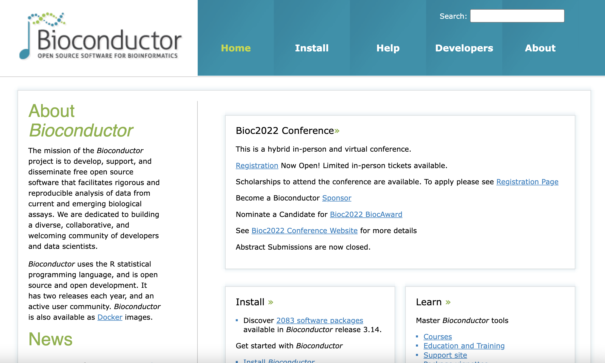
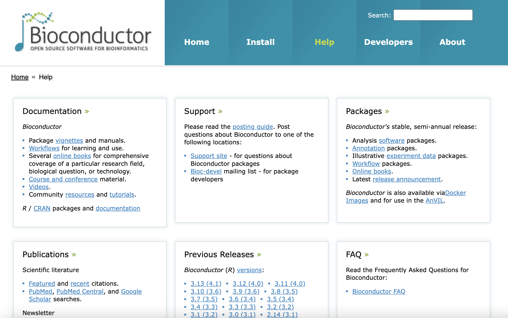
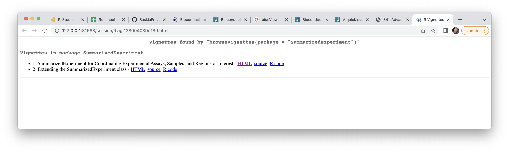

---
# Please do not edit this file directly; it is auto generated.
# Instead, please edit 61-bioconductor.md in _episodes_rmd/
source: Rmd
title: "Bioconductor"
teaching: XX
exercises: XX
questions:
- What is Bioconductor?
- How can I use Bioconductor effectively for my analysis?
objectives:
- Give an overview of the Bioconductor project including its website
- Introduce concepts of reproducibility, coherence, interoperability and stability
keypoints:
- "Bioconductor collates interoperable packages for analyses of biological data."
- "Using biocView can help you to find packages for a specific topic."
---

## Bioconductor

In the previous lesson we have already learned a little bit about the  **Bioconductor**[^Bioconductor] project. In this class we will formalize our
understanding of the **Bioconductor**[^Bioconductor] project. 

**Important:** Remember that Bioconductor packages are downloaded via the function
`BiocManager::install()`. 

Bioconductor is a repository that collects open-source software that facilitates 
rigorous and reproducible analysis of data from current and emerging 
biological assays in R. In addition, 
Bioconductor supports development, education and a thriving community. The
The broad goals of the Bioconductor project are:

* To provide widespread access to a broad range of powerful statistical and graphical methods for the analysis of genomic data.
* To facilitate the inclusion of biological metadata in the analysis of genomic data, e.g. literature data from PubMed, annotation data from Entrez genes.
* To provide a common software platform that enables the rapid development and deployment of extensible, scalable, and interoperable software.
* To further scientific understanding by producing high-quality documentation and reproducible research.
* To train researchers on computational and statistical methods for the analysis of genomic data.

One of the best ways to explore the Bioconductor project is its website.

## The Bioconductor website 

The website tells us that there are over **2,000** packages. This is obviously
way too many packages to explore individually. So how would you find potentially useful packages for the analysis of
your dataset?

### Exploring different topics with biocViews

In Bioconductor, each package is classified as belonging to different categories. 
These different categories are called `biocViews` and they are structured
as follows:

* Software: Packages that provide functions for statistical or graphical methods. 
* AnnotationData: Packages that store annotations (i.e genome annotation) and respective access functions.
* ExperimentData: Packages that store example datasets.
* Workflow: Packages that assemble html tutorials using multiple packages for an analysis.

Each category is further divided into additional sub-categories, which are
divided into sub-sub-categories that refer to specific assays, techniques, and
research fields.

BiocViews can help tremendously  with identifying packages that could be of use to
you in the analysis of your dataset. These are easily searchable once you have navigated 
to [the page that lists all packages](https://bioconductor.org/packages/release/BiocViews.html).

> ## Challenge
> In your groups, identify a research topic of interest and then use the search 
> function to find packages related to this topic.
> Think about the following:
> 
> * What keywords define your topic of interest?
> * What type of packages are good for beginners and why?
> * What other information on this website may be useful?
{: .challenge}

### Exploiting the detailed documentation of the Bioconductor project

The other part of the Bioconductor website crucial for anyone's learning journey
is [the help page](https://bioconductor.org/help/). This page collects some
outstanding Bioconductor learning resources such as

* Comprehensive books introducing coverage of a research field
* Courses and conference materials
* Videos
* Community resources and tutorials.
* [Support site](https://support.bioconductor.org/)

Most importantly it introduces the concept of `vignettes`, which are part of
Bioconductor's mission to enhance **reproducibility** through **rigorous documentation**.
In Bioconductor almost every package (certainly every software package) has to 
include a vignette. Vignettes are small tutorials that explain common use cases
of a package. For example, let's explore the vignettes available for 
`SummarizedExperiment`:

~~~
browseVignettes(package = "SummarizedExperiment")
~~~
{: .language-r}

This should open a separate browser tab that will list availabe vignettes. By 
clicking on the `html` link you will open a nicely formatted tutorial that 
you should be easily able to follow. Vignettes are a great place to start when 
trying to get familar with a new package.

## Core Bioconductor principles

Bioconductor is organized around some core principles:

* interoperablility with existing infrastructure to facilitate reuse and
avoid replication
* coherence in coding, documentation and use of existing infrastructure
* rigorous documentation
* reproducibility
* stability ensuring that there are limited clashes due to versions

While it is not absolutely necessary for the end-user to remember these, the
core principles explain some of the idiosyncrasies of Bioconductor that you
may come across.

### S4 classes

> ## Challenge
>
> Use the function `str` on the SummarizedExperiment object you created during
> the last lession. What oddity do you notice? 
> Hint: Compare the output to output of `str` function applied to `rna`.
>
> > ## Solution
> > 
> > 
> > We can see certain elements of the object starting with an @.
> {: .solution}
{: .challenge}

S4 programming allows object-oriented programming in R and thus ensure **coherence,**
**stability, and interoperability**. Object-oriented programming is a computer programming model that organizes software design around data, or objects, rather than functions and logic. An object can be defined as a data field that has unique attributes and behavior.In S4, certain classes are defined with specific accessibility functions (called methods). 

~~~
# These two statements will result in the same output.

se@colData
~~~
{: .language-r}

~~~
DataFrame with 22 rows and 9 columns
                sample     organism       age         sex   infection
           <character>  <character> <numeric> <character> <character>
GSM2545336  GSM2545336 Mus musculus         8      Female  InfluenzaA
GSM2545337  GSM2545337 Mus musculus         8      Female NonInfected
GSM2545338  GSM2545338 Mus musculus         8      Female NonInfected
GSM2545339  GSM2545339 Mus musculus         8      Female  InfluenzaA
GSM2545340  GSM2545340 Mus musculus         8        Male  InfluenzaA
...                ...          ...       ...         ...         ...
GSM2545353  GSM2545353 Mus musculus         8      Female NonInfected
GSM2545354  GSM2545354 Mus musculus         8        Male NonInfected
GSM2545362  GSM2545362 Mus musculus         8      Female  InfluenzaA
GSM2545363  GSM2545363 Mus musculus         8        Male  InfluenzaA
GSM2545380  GSM2545380 Mus musculus         8      Female  InfluenzaA
                strain      time      tissue     mouse
           <character> <numeric> <character> <numeric>
GSM2545336     C57BL/6         8  Cerebellum        14
GSM2545337     C57BL/6         0  Cerebellum         9
GSM2545338     C57BL/6         0  Cerebellum        10
GSM2545339     C57BL/6         4  Cerebellum        15
GSM2545340     C57BL/6         4  Cerebellum        18
...                ...       ...         ...       ...
GSM2545353     C57BL/6         0  Cerebellum         4
GSM2545354     C57BL/6         0  Cerebellum         2
GSM2545362     C57BL/6         4  Cerebellum        20
GSM2545363     C57BL/6         4  Cerebellum        12
GSM2545380     C57BL/6         8  Cerebellum        19
~~~
{: .output}

~~~
colData(se) #colData is a method that allows access to the column meta data
~~~
{: .language-r}

~~~
DataFrame with 22 rows and 9 columns
                sample     organism       age         sex   infection
           <character>  <character> <numeric> <character> <character>
GSM2545336  GSM2545336 Mus musculus         8      Female  InfluenzaA
GSM2545337  GSM2545337 Mus musculus         8      Female NonInfected
GSM2545338  GSM2545338 Mus musculus         8      Female NonInfected
GSM2545339  GSM2545339 Mus musculus         8      Female  InfluenzaA
GSM2545340  GSM2545340 Mus musculus         8        Male  InfluenzaA
...                ...          ...       ...         ...         ...
GSM2545353  GSM2545353 Mus musculus         8      Female NonInfected
GSM2545354  GSM2545354 Mus musculus         8        Male NonInfected
GSM2545362  GSM2545362 Mus musculus         8      Female  InfluenzaA
GSM2545363  GSM2545363 Mus musculus         8        Male  InfluenzaA
GSM2545380  GSM2545380 Mus musculus         8      Female  InfluenzaA
                strain      time      tissue     mouse
           <character> <numeric> <character> <numeric>
GSM2545336     C57BL/6         8  Cerebellum        14
GSM2545337     C57BL/6         0  Cerebellum         9
GSM2545338     C57BL/6         0  Cerebellum        10
GSM2545339     C57BL/6         4  Cerebellum        15
GSM2545340     C57BL/6         4  Cerebellum        18
...                ...       ...         ...       ...
GSM2545353     C57BL/6         0  Cerebellum         4
GSM2545354     C57BL/6         0  Cerebellum         2
GSM2545362     C57BL/6         4  Cerebellum        20
GSM2545363     C57BL/6         4  Cerebellum        12
GSM2545380     C57BL/6         8  Cerebellum        19
~~~
{: .output}

> ## Challenge
>
> Why is it bad practice to use the @ to access parts of an object?
>
> > ## Solution
> > 
> > 
> > Using methods functions to access certain parts of the object enhances
> > readibility of your code. If the underlying class structure changes (i.e. the
> > name of the element) the method will still work.
> {: .solution}
{: .challenge}

If you want to know more about S4 classes you can find more information in
[these slides on their implementation in the Bioconductor package](https://bioconductor.org/packages/devel/bioc/vignettes/S4Vectors/inst/doc/S4QuickOverview.pdf).

### The release cycle

Bioconductor has two releases each year, typically in April and October, where
all packages are updated to their next version in a way that they are 
**interoperable** (i.e. they do not clash when you load more than one). The releases
conincide with the releases of new R versions, which also happen twice a year. This has
two significant implications:

1) To ensure that packages on Bioconductor work flawlessly **always** use
`BiocManager::install` to install a package, even when it is not a technically
Bioconductor package. Biconductor mirrors most other R package repositories like
CRAN and so the package will be most likely available. This will avoid clashed
with packages being ahead of the Bioconductor release.
2) You will need to update your Bioconductor packages twice a year (after updating R) to have all the latest versions. Refer to [this guide for updating R qnd R-Studio](https://www.r-bloggers.com/2022/01/how-to-install-and-update-r-and-rstudio/)
and [this guide for updating Bioconductor](https://www.bioconductor.org/install/). 

## Working with annotations

Bioconductor provides extensive annotation resources. These can be gene centric, or
genome centric. Annotations can be provided in packages curated by Bioconductor,
or obtained from web-based resources.   

Gene centric AnnotationDbi packages include:

* Organism level: e.g. org.Mm.eg.db.
* Platform level: e.g. hgu133plus2.db, hgu133plus2.probes, hgu133plus2.cdf.
* System-biology level: GO.db
Genome centric GenomicFeatures packages include
* Transcriptome level: e.g. TxDb.Hsapiens.UCSC.hg19.knownGene, EnsDb.Hsapiens.v75.
* Generic genome features: Can generate via GenomicFeatures
One web-based resource accesses biomart, via the biomaRt package:
* Query web-based ‘biomart’ resource for genes, sequence, SNPs, and etc

The most popular annotation packages have been modified so that they can make use
of a new set of methods to more easily access their contents. These four methods
are named: `columns`, `keytypes`, `keys` and `select`. They can currently be used with all `chip`, `organism,` and `TxDb` packages along with the popular `GO.db` package.

An extremely common kind of Annotation package is the so called platform based or
chip based package type. This package is intended to make the manufacturer labels
for a series of probes or probesets to a wide range of gene-based features. A package
of this kind will load an `ChipDb` object. Below is a set of examples to show how you
might use the standard 4 methods to interact with an object of this type.
First we need to load the package:

~~~
suppressPackageStartupMessages({
library(hgu95av2.db)
})
~~~
{: .language-r}

If we list the contents of this package, we can see that one of the many things loaded
is an object named after the package "hgu95av2.db":

~~~
ls("package:hgu95av2.db")
~~~
{: .language-r}

~~~
 [1] "hgu95av2"              "hgu95av2_dbconn"       "hgu95av2_dbfile"      
 [4] "hgu95av2_dbInfo"       "hgu95av2_dbschema"     "hgu95av2.db"          
 [7] "hgu95av2ACCNUM"        "hgu95av2ALIAS2PROBE"   "hgu95av2CHR"          
[10] "hgu95av2CHRLENGTHS"    "hgu95av2CHRLOC"        "hgu95av2CHRLOCEND"    
[13] "hgu95av2ENSEMBL"       "hgu95av2ENSEMBL2PROBE" "hgu95av2ENTREZID"     
[16] "hgu95av2ENZYME"        "hgu95av2ENZYME2PROBE"  "hgu95av2GENENAME"     
[19] "hgu95av2GO"            "hgu95av2GO2ALLPROBES"  "hgu95av2GO2PROBE"     
[22] "hgu95av2MAP"           "hgu95av2MAPCOUNTS"     "hgu95av2OMIM"         
[25] "hgu95av2ORGANISM"      "hgu95av2ORGPKG"        "hgu95av2PATH"         
[28] "hgu95av2PATH2PROBE"    "hgu95av2PFAM"          "hgu95av2PMID"         
[31] "hgu95av2PMID2PROBE"    "hgu95av2PROSITE"       "hgu95av2REFSEQ"       
[34] "hgu95av2SYMBOL"        "hgu95av2UNIPROT"      
~~~
{: .output}

We can look at this object to learn more about it:

~~~
hgu95av2.db
~~~
{: .language-r}

~~~
ChipDb object:
| DBSCHEMAVERSION: 2.1
| Db type: ChipDb
| Supporting package: AnnotationDbi
| DBSCHEMA: HUMANCHIP_DB
| ORGANISM: Homo sapiens
| SPECIES: Human
| MANUFACTURER: Affymetrix
| CHIPNAME: Affymetrix HG_U95Av2 Array
| MANUFACTURERURL: http://www.affymetrix.com
| EGSOURCEDATE: 2021-Apr14
| EGSOURCENAME: Entrez Gene
| EGSOURCEURL: ftp://ftp.ncbi.nlm.nih.gov/gene/DATA
| CENTRALID: ENTREZID
| TAXID: 9606
| GOSOURCENAME: Gene Ontology
| GOSOURCEURL: http://current.geneontology.org/ontology/go-basic.obo
| GOSOURCEDATE: 2021-02-01
| GOEGSOURCEDATE: 2021-Apr14
| GOEGSOURCENAME: Entrez Gene
| GOEGSOURCEURL: ftp://ftp.ncbi.nlm.nih.gov/gene/DATA
| KEGGSOURCENAME: KEGG GENOME
| KEGGSOURCEURL: ftp://ftp.genome.jp/pub/kegg/genomes
| KEGGSOURCEDATE: 2011-Mar15
| GPSOURCENAME: UCSC Genome Bioinformatics (Homo sapiens)
| GPSOURCEURL: 
| GPSOURCEDATE: 2021-Feb16
| ENSOURCEDATE: 2021-Feb16
| ENSOURCENAME: Ensembl
| ENSOURCEURL: ftp://ftp.ensembl.org/pub/current_fasta
| UPSOURCENAME: Uniprot
| UPSOURCEURL: http://www.UniProt.org/
| UPSOURCEDATE: Mon Apr 26 21:53:12 2021
~~~
{: .output}

~~~

Please see: help('select') for usage information
~~~
{: .output}

If we want to know what kinds of data are retriveable via select, then we should use
the columns method like this:

~~~
columns(hgu95av2.db)
~~~
{: .language-r}

~~~
 [1] "ACCNUM"       "ALIAS"        "ENSEMBL"      "ENSEMBLPROT"  "ENSEMBLTRANS"
 [6] "ENTREZID"     "ENZYME"       "EVIDENCE"     "EVIDENCEALL"  "GENENAME"    
[11] "GENETYPE"     "GO"           "GOALL"        "IPI"          "MAP"         
[16] "OMIM"         "ONTOLOGY"     "ONTOLOGYALL"  "PATH"         "PFAM"        
[21] "PMID"         "PROBEID"      "PROSITE"      "REFSEQ"       "SYMBOL"      
[26] "UCSCKG"       "UNIPROT"     
~~~
{: .output}

If we are further curious to know more about those values for columns, we can consult
the help pages. Asking about any of these values will pull up a manual page describing
the different fields and what they mean.

~~~
help("SYMBOL")
~~~
{: .language-r}

If we are curious about what kinds of fields we could potential use as keys to query
the database, we can use the `keytypes` method. In a perfect world, this method will
return values very similar to what was returned by columns, but in reality, some kinds
of values make poor keys and so this list is often shorter.

~~~
keytypes(hgu95av2.db)
~~~
{: .language-r}

~~~
 [1] "ACCNUM"       "ALIAS"        "ENSEMBL"      "ENSEMBLPROT"  "ENSEMBLTRANS"
 [6] "ENTREZID"     "ENZYME"       "EVIDENCE"     "EVIDENCEALL"  "GENENAME"    
[11] "GENETYPE"     "GO"           "GOALL"        "IPI"          "MAP"         
[16] "OMIM"         "ONTOLOGY"     "ONTOLOGYALL"  "PATH"         "PFAM"        
[21] "PMID"         "PROBEID"      "PROSITE"      "REFSEQ"       "SYMBOL"      
[26] "UCSCKG"       "UNIPROT"     
~~~
{: .output}

If we want to extract some sample keys of a particular type, we can use the `keys`
method.

~~~
head(keys(hgu95av2.db, keytype="SYMBOL"))
~~~
{: .language-r}

~~~
[1] "A1BG"  "A2M"   "A2MP1" "NAT1"  "NAT2"  "NATP" 
~~~
{: .output}

And finally, if we have some keys, we can use `select` to extract them. By simply
using appropriate argument values with select we can specify what keys we want to
look up values for (keys), what we want returned back (columns) and the type of
keys that we are passing in (keytype).

~~~
#1st get some example keys
k <- head(keys(hgu95av2.db,keytype="PROBEID"))
# then call select
select(hgu95av2.db, keys=k, columns=c("SYMBOL","GENENAME"), keytype="PROBEID")
~~~
{: .language-r}

~~~
'select()' returned 1:1 mapping between keys and columns
~~~
{: .output}

~~~
    PROBEID  SYMBOL
1   1000_at   MAPK3
2   1001_at    TIE1
3 1002_f_at CYP2C19
4 1003_s_at   CXCR5
5   1004_at   CXCR5
6   1005_at   DUSP1
                                                         GENENAME
1                              mitogen-activated protein kinase 3
2 tyrosine kinase with immunoglobulin like and EGF like domains 1
3                  cytochrome P450 family 2 subfamily C member 19
4                                C-X-C motif chemokine receptor 5
5                                C-X-C motif chemokine receptor 5
6                                  dual specificity phosphatase 1
~~~
{: .output}

An organism level package (an ‘org’ package) uses a central gene identifier (e.g.
Entrez Gene id) and contains mappings between this identifier and other kinds of
identifiers (e.g. GenBank or Uniprot accession number, RefSeq id, etc.). The name
of an org package is always of the form org.<Ab>.<id>.db (e.g. org.Sc.sgd.db)
where <Ab> is a 2-letter abbreviation of the organism (e.g. Sc for Saccharomyces
cerevisiae) and <id> is an abbreviation (in lower-case) describing the type of central identifier (e.g. sgd for gene identifiers assigned by the Saccharomyces Genome
Database, or eg for Entrez Gene ids).
Just as the chip packages load a *ChipDb* object, the org packages will load a *OrgDb*
object. The following exercise should acquaint you with the use of these methods in
the context of an organism package.

> ## Challenge
>
> Display the OrgDb object for the `org.Hs.eg.db` package.
> Use the columns method to discover which sorts of annotations can be extracted
> from it. Is this the same as the result from the keytypes method? Use the keytypes
> method to find out.
> Finally, use the keys method to extract UNIPROT identifiers and then pass those
> keys in to the select method in such a way that you extract the gene symbol and
> KEGG pathway information for each. Use the help system as needed to learn which
> values to pass in to columns in order to achieve this.
>
> > ## Solution
> > 
> > 
> > 
> > ~~~
> > library(org.Hs.eg.db)
> > uniKeys <- head(keys(org.Hs.eg.db, keytype="UNIPROT"))
> > cols <- c("SYMBOL", "PATH")
> > select(org.Hs.eg.db, keys=uniKeys, columns=cols, keytype="UNIPROT")
> > ~~~
> > {: .language-r}
> {: .solution}
{: .challenge}

A *TxDb* package (a ’TxDb’ package) connects a set of genomic coordinates to various
transcript oriented features. The package can also contain Identifiers to features such
as genes and transcripts, and the internal schema describes the relationships between
these different elements. All TxDb containing packages follow a specific naming
scheme that tells where the data came from as well as which build of the genome it
comes from.

> ## Challenge
>
> Display the TxDb object for the `TxDb.Hsapiens.UCSC.hg19.knownGene` package.
> As before, use the columns and keytypes methods to discover which sorts of 
> annotations can be extracted from it.
> Use the `keys` method to extract just a few gene identifiers and then pass those keys in
> to the `select` method in such a way that you extract the transcript ids and transcript
> starts for each.
>
> > ## Solution
> > 
> > 
> > 
> > ~~~
> > library(TxDb.Hsapiens.UCSC.hg19.knownGene)
> > keys <- head(keys(txdb, keytype="GENEID"))
> > cols <- c("TXID", "TXSTART")
> > select(txdb, keys=keys, columns=cols, keytype="GENEID")
> > ~~~
> > {: .language-r}
> {: .solution}
{: .challenge}
