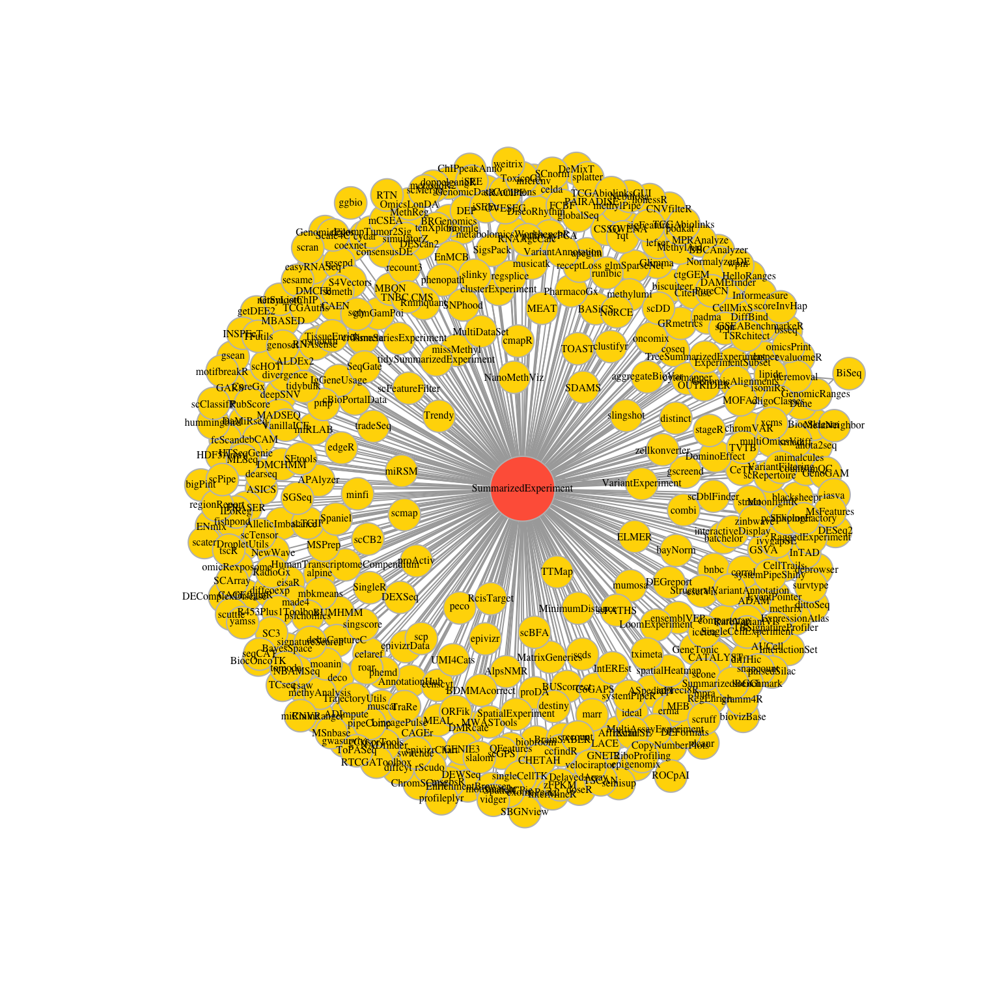
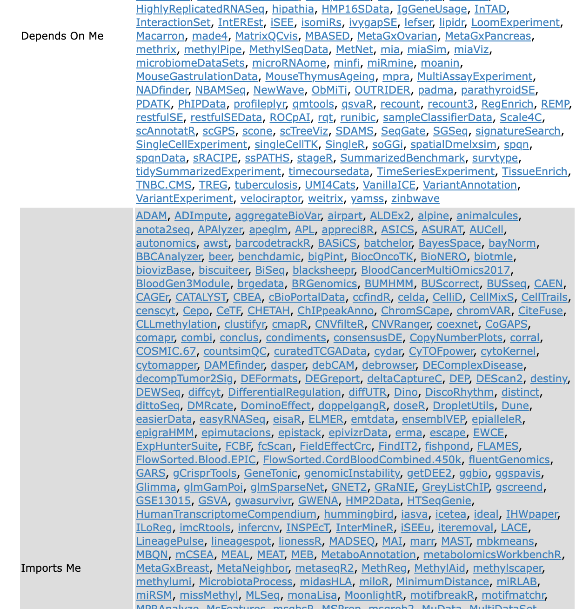

```{r, include=FALSE}
source("../bin/chunk-options.R")
```

## Next steps

Data in bioinformatics is often complex. For example, an experiment can have multiple types of files e.g. counts, sample information and gene information. To deal with this, developers define specialised
data containers (termed classes) that match the properties of the
data they need to handle. 

This aspect is central to the **Bioconductor**[^Bioconductor] project which
uses the same **core data infrastructure** across packages. This certainly contributed
to Bioconductor's success. Bioconductor package developers are advised to make
use of existing infrastructure to provide coherence, interoperability and stability to
the project as a whole. You will learn more about Bioconductor in the next episode.


[^Bioconductor]:The [Bioconductor](http://www.bioconductor.org) was initiated by Robert Gentleman, one of the two creators of the R language. Bioconductor provides tools dedicated to omics data analysis. Bioconductor uses the R statistical programming language, and is open source and open development.

## SummarizedExperiment

To illustrate a Bioconductor omics data container, we'll present the `SummarizedExperiment` class. This is a core structure for omics data such as genomics, transcriptomics, proteomics, methylation and cytometry. The image below from [this website](https://ivanek.github.io/analysisOfGenomicsDataWithR/02_IntroToBioc_html.html#4_Standard_Bioconductor_data_structures) shows how a large number of Bioconductor packages make use of SummarizedExperiment.

```{r SE-core, echo=FALSE, out.width = '80%'}

```

### What is it 

The figure below represents the anatomy of SummarizedExperiment.

```{r SE, echo=FALSE, out.width = '80%'}
knitr::include_graphics("https://uclouvain-cbio.github.io/WSBIM1322/figs/SE.svg")
```

* `assay()`, `assays()`: A matrix-like or list of matrix-like objects of identical dimension
  * rows: genes, genomic coordinates, etc.
  * columns: samples, cells, etc.
* `colData()`: Annotations on each column, as a DataFrame.
E.g., description of each sample
* `rowData()` and / or `rowRanges()`: Annotations on each row.
  * E.g., `rowRanges()`: coordinates of gene / exons in transcripts / etc.
  * E.g., `rowData()`:P-values and log-fold change of each gene after differential expresssion analysis.
* `metadata()`: List of unstructured metadata describing the overall content of the object.
  

### Benefits of SummarizedExperiment format

* **Coordination of samples and features**. As soon as the data for a project are distributed in multiple tables or files, the alignment of data records or the consistency of identifiers is precarious. The coordinated nature of the SummarizedExperiment container overcomes this by guaranteeing that
during data manipulation, the dimensions of the different slots will always match (i.e the columns
in the expression data and the rows in the sample metadata, as well
as the rows in the expression data and feature metadata) during data
manipulation. For example, if we had to exclude one sample from the assay,
it would be automatically removed from the sample metadata in the same operation. The metadata slots can grow additional co-variates
(columns) without affecting the other structures.

* **Interoperability between packages**. There are a lot of R packages that make use of SummarizedExperiment format. For the user this makes analysis easier as less data wrangling is required when outputs of one package can work as input for another. And with many packages using the SummarizedExperiment format there are less different formats to learn. If you follow a training focused on RNA sequencing analysis, you may learn to use the Bioconductor `DESeq2` package to do some differential expression analyses. `DESeq2`'s whole analysis is handled in a `SummarizedExperiment`. Or if you perform RNA sequencing analysis following tidy principles with the [tidybulk](https://stemangiola.github.io/tidybulk/) package you can input your data in SummarizedExperiment format. You can see packages making use of SummarizedExperiment (Depend/Import) on the [SummarizedExperiment homepage](https://bioconductor.org/packages/release/bioc/html/SummarizedExperiment.html), some shown in the screenshot below.


```{r SE-packages,  echo=FALSE, out.width = '60%', out.height = '80%'}

```  

### When would you use it

You may encounter a SummarizedExperiment object 

* using a Bioconductor package function that imports your omics experiment files and produces a SummarizedExperiment object. The [tximeta](https://bioconductor.org/packages/release/bioc/vignettes/tximeta/inst/doc/tximeta.html#Tximeta_import_starts_with_sample_table) for transcript-level quantification is one example of this.  
* using processed data provided in SummarizedExperiment format. The [Recount3 project](http://rna.recount.bio/) provides RNA-sequencing gene, exon, and exon-exon junction counts for 8,679 and 10,088 different studies for human and mouse respectively in SummarizedExperiment format.  
* through creating one yourself to store your data or share with a collaborator

### Exploring a SummarizedExperiment

Let's explore a SummarizedExperiment object in R. We'll load in an example. This is the same RNA data we've been working with but also contains genomic coordinates/ranges. Ranges are an optional part of a SummarizedExperiment. When they're attached, the object is called a `RangedSummarizedExperiment`.

```{r, message = FALSE, include=FALSE}
se <- readRDS("data/se2.rds")
```

```{r, eval = FALSE}
se <- readRDS("course-data/data/GSE96870/se2.rds")
```

```{r message = FALSE}
se
```

We can access the expression matrix with
the `assay` function:

```{r}
head(assay(se))
dim(assay(se))
```

We can access the sample metadata using the `colData` function:

```{r}
colData(se)
dim(colData(se))
```

We can also access the feature metadata using the `rowData` function:

```{r}
head(rowData(se))
dim(rowData(se))
```

If genomic coordinates are present, we can access using the `rowRanges` function:

```{r}
rowRanges(se)
```

`rowRanges` gives us the same information as `rowData` but also includes the coordinates.

### Creating a SummarizedExperiment

Often a package will create a SummarizedExperiment for you but we will demonstrate how a SummarizedExperiment can be created. 
The 3 different tables that make up a SummarizedExperiment object are:
- **An expression matrix**
- **A table describing the samples**
- **A table describing the genes**

You would import these tables into R or generate them in R. Here we will create them from the `se` object that we have.

```{r}
count_matrix <- assay(se)
sample_metadata <- colData(se)
gene_metadata <- rowRanges(se) # or rowData(se)
```

We will create a `SummarizedExperiment` from these tables using the `SummarizedExperiment` constructor. We need to provide inputs for the arguments `assays` (count matrix), `colData` (sample metadata) and `rowData` (gene metadata). Because `assays` can accept multiple assays (e.g. raw counts, log normalized) we put them in a list (SimpleList) and give each assay a name (we'll use counts). We can see we need to do this in the help for the SummarizedExperiment function `?SummarizedExperiment `.

```{r, message = FALSE}
# BiocManager::install("SummarizedExperiment")
library("SummarizedExperiment")

se_created <- SummarizedExperiment(assays = SimpleList(counts=count_matrix),
                           colData = sample_metadata,
                           rowRanges = gene_metadata) # or rowData =
se_created
```

If we want to save a SummarizedExperiment object we can use the `saveRDS` function that we saw in a previous episode.

```{r eval = FALSE}
saveRDS(se_created, file = "data_output/se_created.rds")
```


### Subsetting a SummarizedExperiment

SummarizedExperiment can be subset just like with data frames,
with numerics, characters or logicals. There are two dimensions, the first dimension is features (genes) and the second dimension is samples.

To subset to the first 5 features we could do:

```{r}
se[1:5, ]
```

To subset to the first 3 samples we could do:

```{r}
se[, 1:3]
```

Below, we create a new instance of class SummarizedExperiment that contains only the first 5 features for the first 3 samples.

```{r}
se1 <- se[1:5, 1:3]
se1
```

```{r}
assay(se1)
colData(se1)
rowData(se1)
```

We can also use the `colData()` function to subset on something from the sample metadata, or the `rowData()` to subset on something from the feature metadata.
For example, here we keep only miRNAs and the non infected samples:

```{r}
se1 <- se[rowData(se)$gene_biotype == "miRNA",
          colData(se)$infection == "NonInfected"]
se1
assay(se1)
colData(se1)
rowData(se1)
```

We can subset to a genomic region of interest using the `subsetByOverlaps` function.

```{r}
# Define a region of interest e.g. interval 1 to 10,000,000 of chromosome 1 
roi <- GRanges(seqnames="1", ranges=1:10000000)
# Subset se object for only rows in the region of interest
subsetByOverlaps(se, roi)
```

> ## Challenge
>
> 1. Extract the gene expression levels of the first 3 genes in samples at time 0 and at time 8.
> 2. Extract all genes on chromosome Y between 1 and 10,000,000 on the negative strand.
>
> > ## Solution
> >
> >
> > ```{r, purl=FALSE}
> > assay(se)[1:3, colData(se)$time != "Day4"]
> >
> > # Equivalent to
> > assay(se)[1:3, colData(se)$time == "Day0" | colData(se)$time == "Day8"]
> > ```
> >
> > ```{r, purl=FALSE}
> > roi <- GRanges(seqnames="Y", ranges = 1:10000000, strand = "-")
> > subsetByOverlaps(se, roi)
> >
> > ```
> {: .solution}
{: .challenge}

#### Adding variables to metadata

We can also add information to the sample metadata.
Suppose that you want to add the center where the samples were collected...

```{r}
colData(se)$center <- rep("University of Illinois", nrow(colData(se)))
colData(se)
```

This illustrates that the metadata slots can grow indefinitely without affecting
the other structures!

## tidySummarizedExperiment

You may be wondering, can we use tidyverse commands to interact with SummarizedExperiment objects. The answer is yes, we can with the tidySummarizedExperiment package.

Remember what our SummarizedExperiment object looks like.

```{r, message = FALSE}
se
```

Load tidyverse and tidySummarizedExperiment and then take a look at the se object again.

```{r, message = FALSE}
# BiocManager::install("tidySummarizedExperiment")
library("tidyverse")
library("tidySummarizedExperiment")

se
```

It's still a SummarizedExperiment object but now we can view it as a tibble. Note the first line of the output says this, it's a SummarizedExperiment-tibble abstraction. We can also see in the second line of the output the number of transcripts and samples. 

> ## Reverting to standard SummarizedExperiment view
>
> If we want to revert to the standard SummarizedExperiment view we can do that.
>
> ```{r}
> options("restore_SummarizedExperiment_show" = TRUE)
> se
> ```
> 
> If we want to revert back to tidy SummarizedExperiment view we can.
> 
> ```{r}
> options("restore_SummarizedExperiment_show" = FALSE)
> se
> ```
>
{: .callout}

We can now use tidyverse commands to interact with the SummarizedExperiment object.

We can use `filter` to filter for rows using a condition e.g. to remove a failed sample.

```{r}
se %>% 
    filter(.sample != "GSM2545336")
```

We can use `select` to specify columns we want to view. 

```{r}
se %>% 
    select(.sample)
```

```{r}
se %>%
    count(.sample)
```

We can use `mutate` to add metadata info.

```{r}
se %>%
    mutate(center = "University of Melbourne")
```

We can also combine commands with the tidyverse pipe `%>%`.

For example, we could combine `group_by` and `summarise` to get the total counts for each sample.

```{r}
se %>%
    group_by(.sample) %>%
    summarise(total_counts=sum(counts))
```


Some other tidyverse commands we haven't seen before but that are useful are `slice`, `distinct` and `unite`.

We can use `slice` to choose rows by number e.g. to choose the first row.

```{r}
se %>% 
    slice(1)
```


We can use `distinct` to see what unique information we have.

```{r}
se %>%
    distinct(.sample, infection, sex)
```

We can use `unite` to combine multiple columns into a single column.

```{r}
se %>%
    unite("group", c(infection, time))
```

We can treat `se` as a normal tibble for plotting.

Here we plot the distribution of counts per sample.

```{r tidySE-plot}
se %>%
    ggplot(aes(counts + 1, group=.sample, color=infection)) +
    geom_density() +
    scale_x_log10() +
    theme_bw()
```

To work with genomic coordinates (ranges) with tidy methods, performing subsetting etc,  we can use the [plyranges](https://bioconductor.org/packages/devel/bioc/vignettes/plyranges/inst/doc/an-introduction.html#1_Ranges_revisited) package.


> ## Challenge
>
> 1. Extract the miRNA and NonInfected this time using tidyverse commands.
> 2. Extract the gene expression levels of the 3 first genes in samples at time 0 and at time 8 this time using tidyverse commands.
> 3. Create a bar plot of the sample counts using the se object. Hint use geom_col to plot the summarised counts.
> 
> > ## Solution
> >
> > ```{r, purl=FALSE}
> > se %>% 
> > filter(gene_biotype == "miRNA" & infection == "NonInfected")
> > ```
> >
> > ```{r, purl=FALSE}
> > se %>% 
> >   filter(time == "Day0" | time == "Day8") %>% 
> >   group_by(.sample) %>% 
> >   slice(1:3)
> > ```
> >
> > ```{r, purl=FALSE}
> > se %>%
> >   group_by(.sample) %>%
> >   summarise(total_counts=sum(counts)) %>%
> >   ggplot(aes(x = .sample, y = total_counts)) +
> >   geom_col() +
> >   theme_bw() +
> >   theme(axis.text.x = element_text(angle = 90,  hjust = 0.5, vjust = 0.5))
> > ```
> {: .solution}
{: .challenge}


## Interactive exploration

[iSEE](https://bioconductor.org/packages/release/bioc/vignettes/iSEE/inst/doc/basic.html) is a Bioconductor package that provides an interactive graphical user interface for exploring data stored in SummarizedExperiment objects.

```{r}
# We won't use here but to install and use 
# BiocManager::install('iSEE')
# library(iSEE)
# iSEE(se)
```

## Extensions to SummarizedExperiment

* [SingleCellExperiment](https://bioconductor.org/packages/devel/bioc/vignettes/SingleCellExperiment/inst/doc/intro.html) container extends SummarizedExperiment for **single-cell** data. It follows similar conventions, rows represent features (genes, transcripts, genomic regions) and columns represent cells. It provides methods for storing dimensionality reduction results and data for alternative feature sets (e.g., synthetic spike-in transcripts, antibody-derived tags). It is the central data structure for Bioconductor single-cell packages.

```{r SCE, echo=FALSE, out.width = '80%'}
knitr::include_graphics("https://bioconductor.org/books/release/OSCA.intro/images/SingleCellExperiment.png")
```

  The [Orchestrating Single-Cell Analysis with Bioconductor book](https://bioconductor.org/books/release/OSCA/) is a great resource for single cell analysis that describes using SingleCellExperiment.

  As there is tidySummarizedExperiment for interacting with SummarizedExperiment objects using tidyverse commands, there is equivalently the [tidySingleCellExperiment](https://stemangiola.github.io/tidySingleCellExperiment/) package for SingleCellExperiment objects.

There are also extensions to SummarizedExperiment for other data types:

*  [SpatialExperiment](http://www.bioconductor.org/packages/release/bioc/vignettes/SpatialExperiment/inst/doc/SpatialExperiment.html) for **spatial** data 

* [TreeSummarizedExperiment](https://bioconductor.org/packages/release/bioc/vignettes/TreeSummarizedExperiment/inst/doc/Introduction_to_treeSummarizedExperiment.html) for **microbiome** and other data with hierarchical structures

* [Qfeatures]( http://www.bioconductor.org/packages/release/bioc/vignettes/QFeatures/inst/doc/QFeatures.html) for **proteomics and metabolomics** mass spectrometry data

* [MultiAssayExperiment](https://bioconductor.org/packages/release/bioc/vignettes/MultiAssayExperiment/inst/doc/MultiAssayExperiment.html) for **multi-omics**   data

